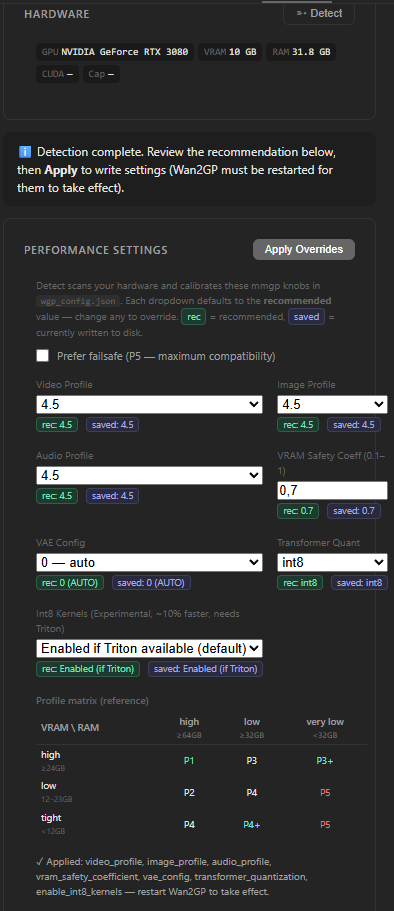
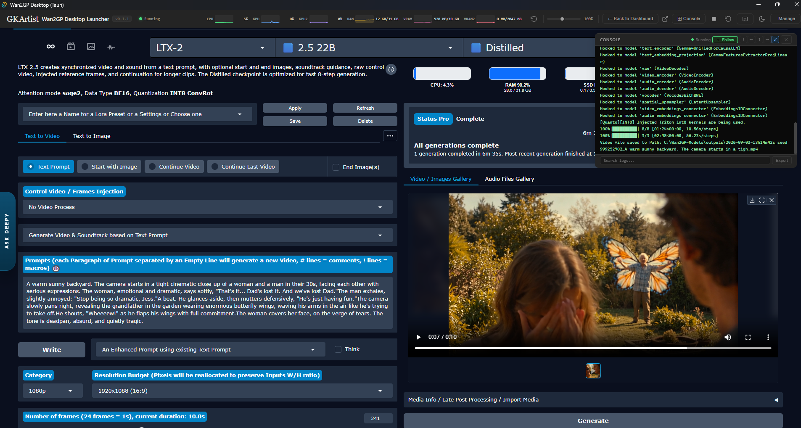
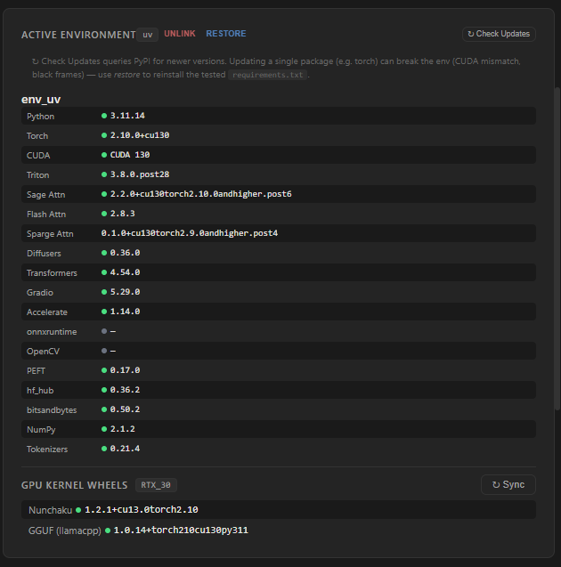
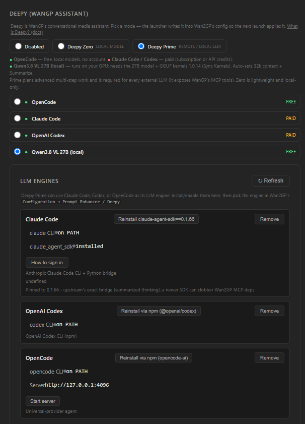
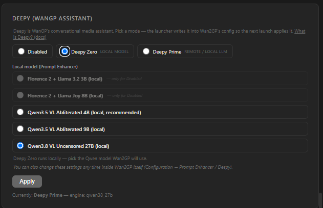
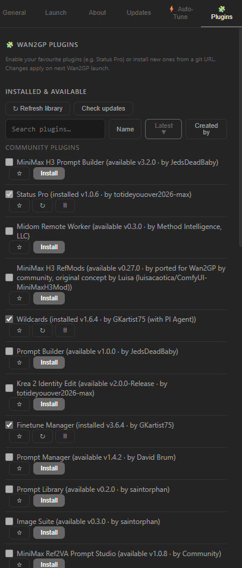
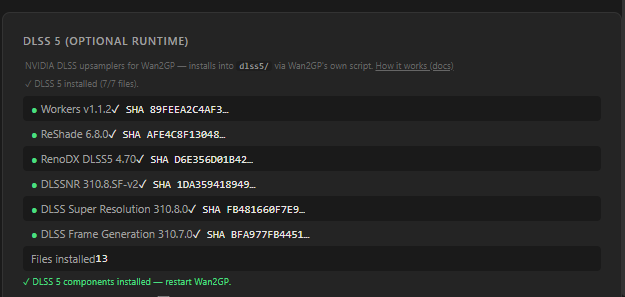

# Wan2GP Desktop Launcher — Tauri Edition

> The easiest way to run **Wan2GP (WanGP)** — the open-source generative video/image/audio toolkit — on Windows. One installer. One click to launch. Zero Python/CUDA setup. Now with a **Rust + Tauri** shell: a fraction of the download, a fraction of the RAM.

[](https://github.com/GKartist75/Wan2GP-Desktop-Tauri/releases) &nbsp; [](https://github.com/GKartist75/Wan2GP-Desktop-Tauri/releases) &nbsp; [](https://tauri.app/) &nbsp; [](https://www.rust-lang.org/)

<p align="center">
  <a href="https://github.com/GKartist75/Wan2GP-Desktop-Tauri/releases/latest" style="display:inline-block;padding:14px 36px;background:#2ea043;color:#fff;border-radius:8px;font-size:1.1rem;font-weight:600;text-decoration:none">
    ⬇ Download for Windows — Latest Release
  </a><br>
  <code>wan2gp-tauri-spike_*_x64-setup.exe</code> · ≈ 3 MB · Windows 10 / 11<br>
  <small>⚠️ Unsigned installer — "unknown publisher" warning is normal for open-source without a code-signing cert.</small>
</p>

---

## Why Tauri? (vs the Electron edition)

Same launcher, same Wan2GP, same features — new shell. The Electron edition ships its own Chromium + Node.js runtime inside every install. The Tauri edition uses the **WebView2 engine already built into Windows 10/11** and a compiled **Rust** backend. No bundled browser, no Node runtime.

| | Electron edition | **Tauri edition** |
|---|---|---|
| Installer download | ≈ 93 MB | **≈ 3 MB (~30× smaller)** |
| Installed app binary | ≈ 300+ MB (Chromium + Node) | **≈ 7 MB** |
| Idle RAM (launcher shell) | ~200–400 MB (full Chromium per window) | **~30–80 MB (shared system WebView2)** |
| Startup | Node + Chromium boot | **Near-instant native boot** |
| Backend | JavaScript on Node | **Compiled Rust (memory-safe, no GC pauses)** |
| Updates | Full 93 MB re-download | Small NSIS/MSI patch |

**What that means for generation:** the launcher is not the part that renders video — but every MB of RAM and VRAM it doesn't waste stays available for models. The Tauri shell idles at a fraction of the footprint, and the **Launcher GPU** setting (Integrated / Disabled-SwiftShader) can push the UI off your NVIDIA card entirely, freeing **1–5 GB VRAM** for Wan2GP.

**What didn't change:** the entire frontend (dashboard, installer, Auto-Tune, Deepy panels, consoles) is the same HTML/CSS/JS. Your `C:\Wan2GP` install, `C:\Wan2GP-Models` library, `wgp_config.json` and `desktop-config.json` carry over untouched — the Tauri build even follows the Electron data-dir pointer automatically.

---

## Why Wan2GP? Why this launcher?

**WanGP by [deepbeepmeep](https://github.com/deepbeepmeep/Wan2GP)** is a one-stop super-app for open-source generative models — video, image, audio and TTS — with a full browser UI, queue, galleries, LoRAs, finetunes and plugins. It runs on as little as **6 GB VRAM** and supports old and new GPUs alike.

**This launcher handles it for you:**

- **One-click install** — detects GPU, shows plan, installs everything
- **Auto, per-GPU kernels** from WanGP's `setup_config.json`, re-synced on every update
- **Isolated `uv` env**, pinned deps, no PATH editing
- **One-click updates** in Dashboard / Manage → Updates
- **Install Wan2GP and Models (checkpoints, LoRAs, outputs) on any drive/folder you choose**
- **Auto-Tune** recommends VRAM/RAM profile and writes config for you
- **Legacy Electron removal** — Manage → About detects the old Electron launcher and removes it silently, keeping all your data

---

## Highlights — What you get with WanGP

Through the launcher you get the **full WanGP** — same models, same UI, same plugins. Nothing stripped.

| Modality | Supported models (via launcher) |
|---|---|
| **Video** | **Wan 2.1 / 2.2** + derivatives, **MiniMax H3** (FL2VA / Ref2VA), **LTX-2 / 2.3 / 2.5**, **HunyuanVideo 1 / 1.5**, **LongCat, Kandinsky, LTXV, MagiHuman, VACE** |
| **Image** | **Krea 2, Qwen Image, Z-Image, Flux 1 / 2** (Klein, Chroma), **SenseNova, Ideogram 4, HiDream, Flux Kontext** |
| **Audio / TTS** | **Qwen3 TTS, AceStep 1/2/XL, Omnivoice, IndexTTS 2/2.5, KugelAudio, HeartMula, Chatterbox, Minimax Music, Stable Audio 3** |

**Run on more hardware**
- **6 GB VRAM** is enough for select models — up to 24 GB+ for max quality/speed.
- **NVIDIA:** GTX 10xx / 16xx, RTX 20xx / 30xx / 40xx / 50xx. **AMD:** RDNA 2 / 3 / 3.5 / 4. **Apple Silicon** (via upstream).
- **Quantized checkpoints:** int8, fp8, GGUF, NV FP4, Nunchaku — architecture-aware downloads.
- **Full web UI:** galleries, reusable settings/templates, mask editor, background remover, pose/depth/flow, diarization, upsampling (RIFE/FlashVSR/Lanczos/SeedVR2), MMAudio/SeedVC, **20+ community plugins**, LoRAs, finetunes, generation queue, headless/API mode.

> Upstream docs: [WanGP README](https://github.com/deepbeepmeep/Wan2GP) · [Installation](https://github.com/deepbeepmeep/Wan2GP/blob/main/docs/INSTALLATION.md) · [Models](https://github.com/deepbeepmeep/Wan2GP/blob/main/docs/MODELS.md)

---

## Key features — What the launcher adds

- 🚀 **One-click install** — detects your GPU, shows exactly what it will install (Git, Python 3.11, PyTorch + CUDA, attention kernels), then does it. Missing Git/Python/uv? One click installs silently — no PATH editing. Reads NVIDIA RTX 20/30/40/50, AMD, Apple Silicon and picks the matching PyTorch + CUDA/ROCm build before installing.
- 🎯 **Always the right kernels** — per-GPU wheel set from WanGP's own `setup_config.json`. Re-syncs on install and every update. No stale wheels when upstream bumps them. Isolated Python 3.11 `uv` env with pinned deps.
- 📂 **Clean data layout** — `C:\Wan2GP` (app) + `C:\Wan2GP-Models` (models) by default, out of roaming AppData. **Both are pre-filled defaults — pick any drive/folder at install.**
- 🖥️ **Flexible launch** — Desktop (in-app embed), Browser, or External Terminal; pop-out, zoom, browser picker.
- 🔄 **Safe updates** — manual-only, version-aware. Nothing downloads without your action. Dashboard + **Manage → Updates** (WanGP core + launcher).
- 📂 **Paths migrate** — move installs between drives from Dashboard → Paths, no freeze, no leftovers, cross-drive safe.
- 🛡️ **Crash-proof UI** — crash recovery restores your session instead of stranding you on a blank screen.
- 🧹 **Electron → Tauri switch** — Manage → About finds the legacy Electron launcher and uninstalls it silently. Wan2GP, models, LoRAs, outputs and settings are kept.

> **⚡ CUDA 13 stack on modern RTX cards.** RTX 20/30/40/50 get **PyTorch 2.10 + CUDA 13** — SageAttention 2.2 (RTX 30/40) / 1.0.6 (RTX 20), FlashAttention 2.8.3, SpargeAttention (30/40/50), LightX2V (RTX 50), Nunchaku INT4/FP4 + **GGUF 1.0.13** + **bitsandbytes 0.49.2** (NF4). GTX 10/16 stay on **CUDA 12.8** (no R580 needed); every other NVIDIA card needs **R580+** and is checked before install.

---

## 🔥 What's New

> Full history: [CHANGELOG.md](CHANGELOG.md)

- **v0.2.1** — live console download bars (bootstrap fix).
- **v0.2.0** — 🧩 Plugin Manager tab (Status Pro default plugin, favourites auto-install) · ✨ DLSS5 one-click installer with live SHA checklist · Deepy local Qwen3.8 Prime + Claude bridge 0.1.66 + npm/`cmd /C` fix · Auto-Tune Int8 Kernels default-on · maximized window · scoped Stop (only our processes).
- **v0.1.3** — renamed to Wan2GP Desktop Launcher Tauri (product, binary, installer); topbar cleanup (Electron port): reload after Console, red stop button, no title overlap.
- **v0.1.2** — env unlink/restore as live state-driven buttons (backend-resolved name, console progress instead of freezes); release script fixes.
- **v0.1.1** — first Tauri feature-complete build: 10-module Rust backend, console-first Desktop launch with hide/show session switching, full 7-profile Auto-Tune, validated Deepy writer, one-click signed updater, Apprise notifier, real per-package upgrades, GGUF kernel knobs that actually apply, legacy Electron removal, full cleanup on close.

---

## Download & Install

**Coming from the Electron edition?** Install the Tauri build, open **Manage → About → Remove Electron launcher**. Your data carries over automatically — no reinstall of Wan2GP or models needed.

1. Download the `*-setup.exe` (NSIS) or `*.msi` from **Releases** (button at top).
2. Run it — pick install + models folders (or accept `C:\Wan2GP` / `C:\Wan2GP-Models`). The screen detects your GPU and lists exactly what it will install — all paths are editable.
3. Click **Install** (~5–20 min: clone → `uv` venv → PyTorch+CUDA → requirements → kernels → `wgp_config.json`).
4. Click **Launch** — **Desktop** (in-app) or **Browser**.

No Python, no CUDA toolkit, no `pip`, no Node needed beforehand — the installer fetches what it needs. (WebView2 itself ships with Windows 10/11.)

### Launch modes

- **Desktop** — Wan2GP embedded in the launcher, with reload, zoom 25–200%, hide/show switching that keeps your session, and console-first boot (watch the dashboard log, view opens when ready).
- **Browser** — visible console + auto-opens your browser when ready.
- **External Terminal** — real Windows Terminal / cmd via generated script; in-app LED + Stop.
- **No-GPU Chrome** — launch Chrome with GPU disabled to free VRAM for generation.
- **Browser picker** — detects Chrome, Edge, Firefox, Brave, Opera, Vivaldi.

### Where is everything? (defaults)

```
C:\Wan2GP\                      ← repo + launcher data (self-contained)
   ├─ wgp.py                    ← Wan2GP core
   ├─ env_uv\                   ← Python 3.11 venv (uv)
   ├─ wgp_config.json           ← settings (ckpts → C:\Wan2GP-Models\ckpts)
   ├─ desktop-config.json       ← launcher config
   └─ boot.log                  ← diagnostic

C:\Wan2GP-Models\               ← your large files (any drive you chose)
   ├─ ckpts\                    ← checkpoints
   ├─ loras\                    ← LoRAs
   └─ outputs\                  ← generated videos/images/audio
```
> `C:\Wan2GP` / `C:\Wan2GP-Models` are pre-filled defaults — Browse to any drive/folder at install or later via **Dashboard → Migrate to new location**.

---

## ⚡ Auto-Tune — one click, right profile

**Manage → Auto-Tune** (or ⚡ on the dashboard) scans GPU/VRAM/RAM/kernels and recommends the optimal `wgp_config.json` settings. All three profile dropdowns (video/image/audio) stay editable before you Apply.

WanGP's memory manager (`mmgp`) uses 7 profiles trading VRAM for speed — Auto-Tune picks from your VRAM × RAM:

| VRAM ↓ \ RAM → | ≥64 GB | ≥32 GB | <32 GB |
|---|---|---|---|
| **≥24 GB** | P1 max perf | P3 | P3+ RAM saver |
| **12–23 GB** | P2 | **P4 balanced** | P5 |
| **<12 GB** | P4 | P4+ VRAM saver | **P5 failsafe** |

**Settings written** to `wgp_config.json`: `video/image/audio_profile` (1–5), `transformer_quantization` (Int8 / FP8 / NVFP4 / None), `enable_int8_kernels` (default on — experimental, ~10% faster with INT8 checkpoints, needs Triton), `vae_config` (always Auto), `vram_safety_coefficient` (0.80 / 0.70 / 0.60). **Failsafe** checkbox forces P5 for hardware where the recommendation still crashes.



---

## 📊 Monitoring & control

- **Dockable console** — live server log in green-on-black, dock to bottom/left/top or float. Search, export, resize. Toggle via topbar button.
- **Topbar sparklines** — CPU/GPU/RAM/VRAM mini real-time charts.
- **Running LED & Stop** — status light + one-click server stop.
- **Auto-start with Windows**, notifications on server ready/stop.
- **Keyboard shortcuts** — <kbd>Esc</kbd>/<kbd>Ctrl+W</kbd> close webview.
- **Maintenance** — update WanGP or the launcher from **Dashboard** or **Manage → Updates**, switch envs, or uninstall from the UI. **Dashboard → Paths** migrates installs between drives.

### Screenshots


*The launcher as a whole: topbar with live CPU/GPU/RAM/VRAM sparklines and update LED, Wan2GP (LTX-2.5 Distilled) embedded in Desktop view, floating console streaming the live log with progress bars, finished video in the gallery.*

---

## 🔧 GPU kernels — what gets installed per GPU

WanGP is faster with vendor kernels than stock PyTorch. The launcher reads WanGP's own `setup_config.json` and shows exactly what it will install — and re-syncs on every update.

| Wheel | Version | What it does |
|-------|---------------|---------------|
| **Python** (uv) | `3.11.14` (RTX 20–50) / `3.10.9` (GTX 10) | venv interpreter |
| **PyTorch + CUDA** | `2.10.0` + CUDA 13.0 | tensor + GPU runtime |
| **Triton** | `latest` (3.7.1) | JIT for custom CUDA/attention kernels on Windows |
| **SageAttention** | `1.0.6` (RTX 20) / `2.2.0` (RTX 30–50) | fused attention — big speed-up |
| **SpargeAttn** | `0.1.0` | sparsity-aware speed-up alongside Sage |
| **FlashAttention** | `2.8.3` | memory-efficient exact attention for long/high-res |
| **Nunchaku** | `1.2.1` | SVD-quantized (NF4/SVDQ) runtime — 4/8-bit models |
| **GGUF llama.cpp CUDA** | `1.0.14` | CUDA GGUF kernels (Stream-K, quantized KV-cache, speculative-workload fix) |
| **LightX2V** | `0.0.2` | FP4 kernels — **RTX 50xx / sm120+ only** |
| **bitsandbytes** | `0.49.2` | 8-bit/NF4 dequant for NF4 checkpoints |

**Per-GPU set:** RTX 20 → Sage 1.0.6 + Flash + Nunchaku + GGUF + bnb. RTX 30/40 → add Sparge + Sage 2.2.0. RTX 50 → add LightX2V. All get bitsandbytes. Versions track `setup_config.json` — next update installs new wheels automatically.

**PyTorch matrix:** RTX 20/30/40/50 → Py 3.11.14 + PyTorch 2.10 + CUDA 13.0/13.1 · GTX 10xx → Py 3.10.9 + PyTorch 2.7.1 + CUDA 12.8. Avoids 2.8.0 (RAM leak) + 2.9.0 (VAE VRAM bug).

> Upstream: [INSTALLATION.md](https://github.com/deepbeepmeep/Wan2GP/blob/main/docs/INSTALLATION.md)



---

## Deepy — your offline agent

Configure without editing JSON: **Settings → Deepy** or the Dashboard card.

- **Disabled** — Deepy off; keeps local Prompt Enhancer.
- **Deepy Zero** — local, no account/key. Qwen VL models.
- **Deepy Prime** — remote LLM via **OpenCode** (free, local models), **Claude Code** (`claude-agent-sdk==0.1.66` pinned bridge) or **Codex** (paid), or local **Qwen3.8 VL 27B** (needs the 27B model + GGUF 1.0.14; auto-sets 32k context + Summarize). Prime exposes WanGP's MCP tools.

Switching live-re-renders the selector; **Apply** writes a consistent `wgp_config.json` (with backup). Also editable inside WanGP: *Configuration → Prompt Enhancer / Deepy*.





> New to this? Start with **OpenCode** — the only zero-cost option.

---

## 🧩 Plugin Manager — Status Pro included

**Manage → Plugins** lists Wan2GP's catalog merged with your installed `plugins/` folder (system vs community grouping), with search, Name/Latest/Author sort, and per-plugin enable checkboxes. From a git URL you can install (clone + `requirements.txt` + enable), per-plugin ↻ check/update, 🗑 uninstall, library refresh, and check-all-updates — all with console progress.

- **Status Pro** is a default plugin: installed automatically on fresh setup and kept enabled (locked checkbox), but still uninstallable — one click reinstalls it.
- **★ Favourites** auto-install on fresh setup (stored in `desktop-config.json` → `favoritePlugins`).
- Changes apply on next Wan2GP launch.



## ✨ DLSS5 installer — optional NVIDIA upsamplers

Dashboard card runs WanGP's own `scripts/install_dlss5.ps1` (workers v1.1.3, ReShade 6.8.0, RenoDX 4.70, DLSSNR 310.8.SF-v2, DLSS 310.8.0, Frame Generation 310.7.0) into `C:\Wan2GP\dlss5\` with a live per-component checklist — downloading → SHA-256 ✓ → installed — plus console progress.



- Strict consent: type `I ACCEPT` (third-party binaries are community-hosted, unsigned, proprietary — see [docs/DLSS5.md](https://github.com/deepbeepmeep/Wan2GP/blob/main/docs/DLSS5.md)).
- **Force** backs up + replaces conflicting files. **Stop Wan2GP first.**
- Needs Windows 11 + RTX 30+ (Neural Rendering, 30 experimental) / RTX 40+ (Frame Generation) + HAGS.

## 🛠 Build from source

Prerequisites: [Rust](https://rustup.rs/) (1.77.2+) + Node.js. WebView2 comes with Windows.

```bash
git clone https://github.com/GKartist75/Wan2GP-Desktop-Tauri.git
cd Wan2GP-Desktop-Tauri
npx tauri build      # NSIS + MSI in src-tauri/target/release/bundle/
```

Backend lives in `src-tauri/src/lib.rs` (`#[tauri::command]` handlers); frontend is vanilla HTML/CSS/JS in `src/` calling them via `invoke()` (`src/w2gp.js` bridge).

---

## Credits & License

Wan2GP Desktop Launcher wraps [Wan2GP](https://github.com/deepbeepmeep/Wan2GP) by deepbeepmeep. The Electron edition lives at [wan2gp-desktop](https://github.com/GKartist75/wan2gp-desktop); this repo is its Tauri port.

Discord: [WanGP Community](https://discord.gg/g7efUW9jGV) · X: [@deepbeepmeep](https://x.com/deepbeepmeep) · Site: [wangp.ai](https://wangp.ai/)
