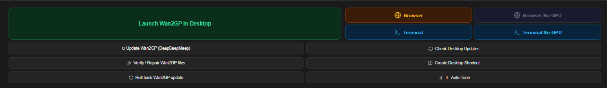
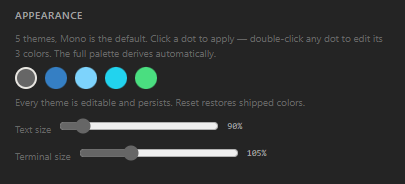
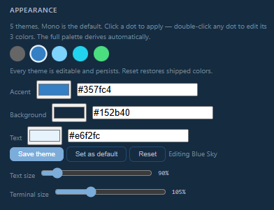
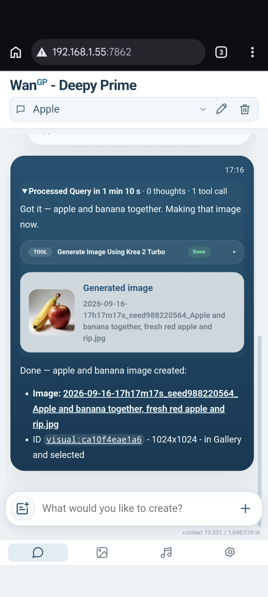
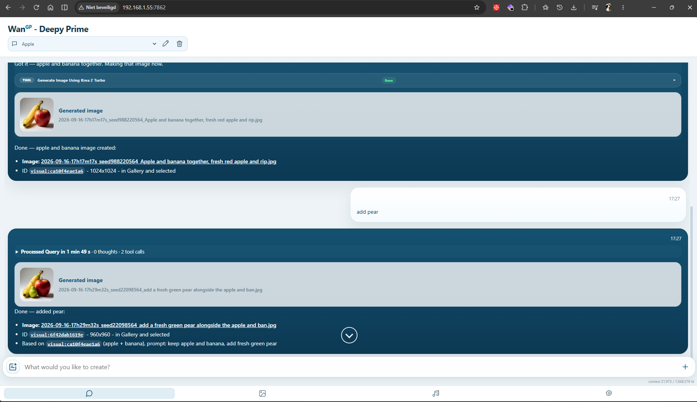
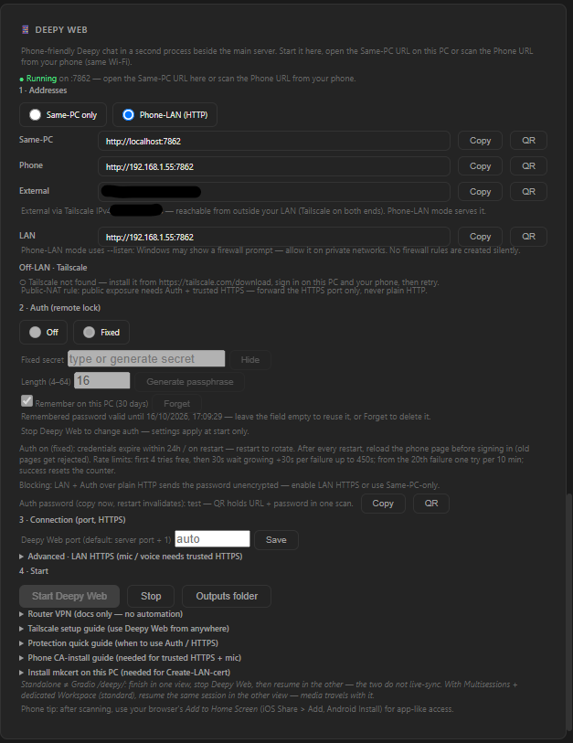
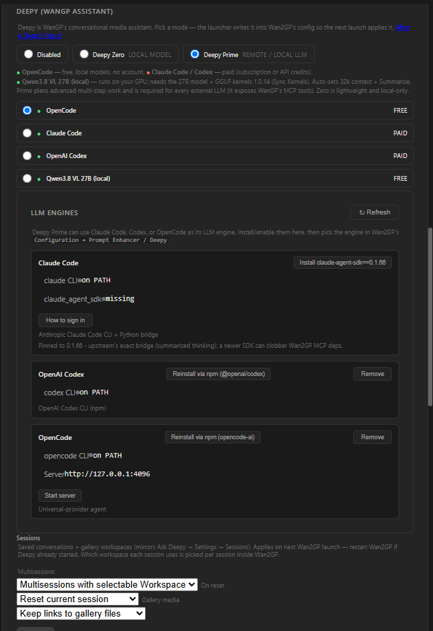
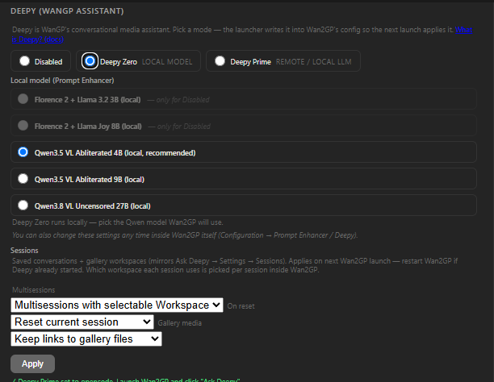
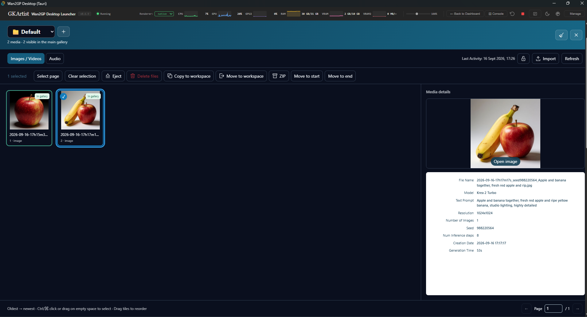

# Wan2GP Desktop Launcher — Tauri Edition

> The easiest way to run **Wan2GP (WanGP)** — the open-source generative video/image/audio toolkit — on Windows. One installer. One click to launch. Zero Python/CUDA setup. Now with a **Rust + Tauri** shell: a fraction of the download, a fraction of the RAM.

[](https://github.com/GKartist75/Wan2GP-Desktop-Tauri/stargazers) &nbsp; [](https://github.com/GKartist75/Wan2GP-Desktop-Tauri/releases) &nbsp; [](https://github.com/GKartist75/Wan2GP-Desktop-Tauri/releases) &nbsp; [](https://tauri.app/) &nbsp; [](https://www.rust-lang.org/)

<p align="center">
  <a href="https://github.com/GKartist75/Wan2GP-Desktop-Tauri/releases/latest" style="display:inline-block;padding:14px 36px;background:#2ea043;color:#fff;border-radius:8px;font-size:1.1rem;font-weight:600;text-decoration:none">
    ⬇ Download for Windows — Latest Release
  </a><br>
  <code>wan2gp-tauri-spike_*_x64-setup.exe</code> · ≈ 3 MB · Windows 10 / 11<br>
  <small>⚠️ Unsigned installer — "unknown publisher" warning is normal for open-source without a code-signing cert.</small>
</p>

> **New here? What is Wan2GP?** [WanGP](https://github.com/deepbeepmeep/Wan2GP) by deepbeepmeep is the open-source app this launcher installs — video, image, audio and TTS generation in your browser, running on as little as **6 GB VRAM**. This repo is only the Windows launcher: one-click install, per-GPU kernels, Auto-Tune profiles, no Python/CUDA setup. Details: [What you get](#what-you-get).

## Contents

- [User Guide — all screens, tabs & buttons](docs/USER-GUIDE.md)
- [WanGP Guidance — what to make, which model & settings](docs/WAN2GP-GUIDE.md)
- [Download & Install](#download--install)
- [🔥 What's New](#-whats-new)
- [Screenshots](#screenshots)
- [Why Tauri?](#why-tauri)
- [What you get](#what-you-get)
- [⚡ Auto-Tune](#-auto-tune--one-click-right-profile)
- [📊 Monitoring & control](#-monitoring--control)
- [🔧 GPU kernels](#-gpu-kernels--what-gets-installed-per-gpu)
- [Deepy — your offline agent](#deepy--your-offline-agent)
- [🧩 Plugin Manager & ✨ DLSS5](#-plugin-manager)
- [🧭 Guide & 📚 Library](#-guide--library)
- [🛠 Build from source](#-build-from-source)
- [⭐ Star History](#-star-history)
- [Credits & License](#credits--license)

---

## Download & Install

1. Download the `*-setup.exe` (NSIS) or `*.msi` from **Releases** (button at top).
2. Run it — pick install + models folders (or accept `C:\Wan2GP` / `C:\Wan2GP-Models`). The screen detects your GPU and lists exactly what it will install — all paths are editable.
3. Click **Install** (~5–20 min: clone → env (`uv`/`venv`/`conda`, your pick) → PyTorch+CUDA → requirements → kernels → `wgp_config.json`). If the folder already holds a repo without a working env, tick your choice (repair env vs fresh repo) and press Install.
4. Click **Launch** — **Desktop** (in-app) or **Browser**.

No Python, no CUDA toolkit, no `pip`, no Node needed beforehand — the installer fetches what it needs. (WebView2 itself ships with Windows 10/11.)

### Launch buttons



- **Desktop** — Wan2GP embedded in the launcher, with reload, zoom 25–200%, hide/show switching that keeps your session, and console-first boot (watch the dashboard log, view opens when ready). The embedded page follows the launcher theme (dark/light via Gradio's theme param; Gradio's own toggle still wins afterwards). Browser-parity media flow: drag & drop files into Gradio dropzones works, and new gallery arrivals pop a Save / Save As… prompt (with real file-type filters — issue #29).
- **Browser** — visible console + auto-opens your browser when ready.
- **External Terminal** — real Windows Terminal / cmd via generated script; in-app LED + Stop.
- **No-GPU Chrome** — launch Chrome with GPU disabled to free VRAM for generation.
- **Browser picker** — detects Chrome, Edge, Firefox, Brave, Opera, Vivaldi.

### Where is everything? (defaults)

Three separate things, three places:

```
1) The launcher app itself (≈ 12 MB)   ← installed by the setup.exe
   %LocalAppData%\Wan2GP Desktop Launcher Tauri\
   Uses the WebView2 engine already in Windows — no bundled Chromium.
   (Machine-wide install goes to Program Files instead.)

2) Wan2GP + launcher data (self-contained, you pick the folder)
C:\Wan2GP\                      ← repo + launcher data
   ├─ wgp.py                    ← Wan2GP core
   ├─ env_uv\                   ← Python 3.11 venv (uv)
   ├─ wgp_config.json           ← settings (ckpts → C:\Wan2GP-Models\ckpts)
   ├─ desktop-config.json       ← launcher config (lives HERE, not in AppData)
   └─ boot.log                  ← diagnostic

3) Your large files (any drive you chose)
C:\Wan2GP-Models\               ← models library
   ├─ ckpts\                    ← checkpoints
   ├─ loras\                    ← LoRAs
   └─ outputs\                  ← generated videos/images/audio
```

> `C:\Wan2GP` / `C:\Wan2GP-Models` are pre-filled defaults — Browse to any drive/folder at install or later via **Dashboard → Migrate to new location**. A custom data folder is remembered in `%USERPROFILE%\.wan2gp-tauri-data-dir` (the old Electron pointer is followed automatically, so your install carries over).

## 🔥 What's New

> Full history: [CHANGELOG.md](CHANGELOG.md)

- [**v0.8.3**](https://github.com/GKartist75/Wan2GP-Desktop-Tauri/releases/tag/v0.8.3) *(latest)* — GGUF 1.0.23 + cu128 split, Sync `--no-deps` fix (issue #44), self-updating floor + setup_config validation + post-update compat check, collapsed card update badge, Desktop follows launcher theme (issue #43). Details in [CHANGELOG](CHANGELOG.md).

- [**v0.8.2**](https://github.com/GKartist75/Wan2GP-Desktop-Tauri/releases/tag/v0.8.2) — 📱 Phone & remote access panel (main-server `--listen` toggle with restart-in-place, Gradio + `/deepy/` phone URLs with QR, merged with Deepy Web), collapsible left panels with live header actions, Manage tabs reorganized, topbar alignment, console Clear button, control taxonomy styling, Deepy port reset-to-auto, env-switcher fix. Details in [CHANGELOG](CHANGELOG.md).

- [**v0.8.1**](https://github.com/GKartist75/Wan2GP-Desktop-Tauri/releases/tag/v0.8.1) — AMD experimental HIP GGUF opt-in button, Deepy Web start-command transparency + Extra args + fast-fail boot wait, `--listen` spelled out on the mode radios. Details in [CHANGELOG](CHANGELOG.md).

- [**v0.8.0**](https://github.com/GKartist75/Wan2GP-Desktop-Tauri/releases/tag/v0.8.0) — native-first queue notifications (Apprise destinations in `wgp_config.json`, credential-store support, test button, `apprise`+`keyring` install, legacy sender fallback), launch hardening against stray `%TEMP%` scripts shadowing stdlib (issue #36). Details in [CHANGELOG](CHANGELOG.md).

- [**v0.7.5**](https://github.com/GKartist75/Wan2GP-Desktop-Tauri/releases/tag/v0.7.5) — Guide topbar tab, Library tab, launch presets/builder, MCP helper, headless batch runner, workspace backup, config snapshots + restore, engine checks, support-bundle probes, 10-guide infographics. Details in [CHANGELOG](CHANGELOG.md).

- Older releases: full history in [CHANGELOG.md](CHANGELOG.md) (v0.7.4 to v0.1.x).

---

## Screenshots


*Desktop view: Wan2GP (LTX-2.5 Distilled) embedded, floating console streaming the live log, topbar CPU/GPU/RAM/VRAM sparklines.*

<table>
  <tr>
    <td><br><sub>Auto-Tune — hardware detection with rec/saved tags</sub></td>
    <td><br><sub>Active Environment — installed packages and GPU kernel wheels</sub></td>
  </tr>
  <tr>
    <td><br><sub>Deepy Prime — local Qwen3.8 + remote LLM engines</sub></td>
    <td><br><sub>Plugin Manager — community catalog, install, update, favourites</sub></td>
  </tr>
  <tr>
    <td colspan="2"><br><sub>DLSS5 installer — live per-component checklist with SHA-256 verification</sub></td>
  </tr>
</table>

---

## Why Tauri?

Same launcher, same Wan2GP, same features — lightweight native shell. It uses the **WebView2 engine already built into Windows 10/11** and a compiled **Rust** backend. No bundled browser, no Node runtime.

- Installer download: **≈ 4 MB**
- Installed app: **≈ 12 MB**
- Idle RAM (launcher shell): **~30–80 MB (shared system WebView2)**
- Startup: **near-instant native boot**
- Backend: **compiled Rust (memory-safe, no GC pauses)**
- Updates: **small NSIS/MSI patch**

**What that means for generation:** the launcher is not the part that renders video — but every MB of RAM and VRAM it doesn't waste stays available for models. The Tauri shell idles at a fraction of the footprint, and the **Launcher GPU** setting (Integrated / Disabled-SwiftShader) can push the UI off your NVIDIA card entirely, freeing **1–5 GB VRAM** for Wan2GP.

**Your install carries over:** the entire frontend (dashboard, installer, Auto-Tune, Deepy panels, consoles) is the same HTML/CSS/JS. Your `C:\Wan2GP` install, `C:\Wan2GP-Models` library, `wgp_config.json` and `desktop-config.json` carry over untouched — a custom data-dir pointer is followed automatically.

---

## What you get

**WanGP by [deepbeepmeep](https://github.com/deepbeepmeep/Wan2GP)** is a one-stop super-app for open-source generative models — video, image, audio and TTS — with a full browser UI, queue, galleries, LoRAs, finetunes and plugins. It runs on as little as **6 GB VRAM** and supports old and new GPUs alike. Through this launcher you get the **full WanGP** — same models, same UI, same plugins. Nothing stripped.

| Modality | Supported models (via launcher) |
| --- | --- |
| **Video** | **Wan 2.1 / 2.2** + derivatives, **MiniMax H3** (FL2VA / Ref2VA), **LTX-2 / 2.3 / 2.5**, **HunyuanVideo 1 / 1.5**, **LongCat, Kandinsky, LTXV, MagiHuman, VACE** |
| **Image** | **Krea 2, Qwen Image, Z-Image, Flux 1 / 2** (Klein, Chroma), **SenseNova, Ideogram 4, HiDream, Flux Kontext** |
| **Audio / TTS** | **Qwen3 TTS, AceStep 1/2/XL, Omnivoice, IndexTTS 2/2.5, KugelAudio, HeartMula, Chatterbox, Minimax Music, Stable Audio 3, YuE2, AuK Speech, Scenema Audio, DramaBox** |

**Run on more hardware:** 6 GB VRAM is enough for select models (up to 24 GB+ for max quality). NVIDIA GTX 10xx/16xx, RTX 20xx/30xx/40xx/50xx · AMD RDNA 2/3/3.5/4 · Apple Silicon (via upstream). Quantized checkpoints (int8, fp8, GGUF, NV FP4, Nunchaku) with architecture-aware downloads. Full web UI: galleries, templates, mask editor, background remover, pose/depth/flow, diarization, upsampling (RIFE/FlashVSR/Lanczos/SeedVR2), MMAudio/SeedVC, **20+ community plugins**, LoRAs, finetunes, queue, headless/API mode.

> Upstream docs: [WanGP README](https://github.com/deepbeepmeep/Wan2GP) · [Installation](https://github.com/deepbeepmeep/Wan2GP/blob/main/docs/INSTALLATION.md) · [Models](https://github.com/deepbeepmeep/Wan2GP/blob/main/docs/MODELS.md)

**What the launcher adds:**

- 🚀 **One-click install** — GPU detect → plan → preflight (Python pin, disk space, drivers, folder triage) → live progress. Missing Git/Python/uv installs silently, no PATH editing.
- 🎯 **Always the right kernels** — per-GPU wheels from WanGP's `setup_config.json`, re-synced on install and every update, plus launcher safety overrides (GGUF floor, sage safe build) with one-click pure-upstream Restore.
- 📂 **Clean data layout** — `C:\Wan2GP` (app) + `C:\Wan2GP-Models` (models), both editable to any drive/folder; migrate later via Dashboard → Paths.
- 🖥️ **Flexible launch** — Desktop embed, Browser, or External Terminal; pop-out, zoom, browser picker.
- 🎨 **5 themes + text sizing** — Mono (default), Blue Sky, Orca, Cyber, Matrix; every theme editable (accent/background/text, live preview, Save/Set-as-default/Reset), topbar palette quick-switch, Text + Terminal size sliders in Manage → Appearance.

<table>
  <tr>
    <td><br><sub>Appearance — 5 themes, Mono default, click to apply</sub></td>
    <td><br><sub>Appearance editor — 3 colors per theme, Save/Set-as-default/Reset</sub></td>
  </tr>
</table>

- 🔄 **Safe updates** — manual-only, version-aware, from Dashboard / Manage → Updates.
- 🛡️ **Crash-proof UI** — crash recovery restores your session.
- 🧩 **Pinokio coexistence** — Pinokio installs detected and left untouched; one click reuses their model library, no re-downloads.

---

## ⚡ Auto-Tune — one click, right profile

**Manage → Auto-Tune** (or ⚡ on the dashboard) scans GPU/VRAM/RAM/kernels and recommends the optimal `wgp_config.json` settings. All three profile dropdowns (video/image/audio) stay editable before you Apply.

**VRAM × RAM profile matrix**

| VRAM ↓ \ RAM → | ≥64 GB | ≥32 GB | <32 GB |
| --- | --- | --- | --- |
| **≥24 GB** | P1 max perf | P3 | P3+ RAM saver |
| **12–23 GB** | P2 | **P4 balanced** | P5 |
| **<12 GB** | P4 | P4+ VRAM saver | **P5 failsafe** |

**Settings written to `wgp_config.json`**

`video/image/audio_profile` (1–5), `transformer_quantization` (Int8 / FP8 / NVFP4 / None), `int8_kernels` (Auto / Comfy Kitchen / Triton / Disabled — upstream v13.13 replacement for the old numeric toggle), `kernel_precision` (fast approximate / strict), `vae_config` (always Auto: 16GB+ / 8GB+ / 6GB+ presets), `vram_safety_coefficient` (0.80 / 0.70 / 0.60). **Failsafe** checkbox forces P5 for hardware where the recommendation still crashes.

---

## 📊 Monitoring & control

- **Dockable console** — live server log in green-on-black, dock to bottom/left/top or float. Search, export, **Clear**.
- **Topbar sparklines** — CPU/GPU/RAM/VRAM mini real-time charts.
- **Running LED & Stop** — status light + one-click server stop.
- **Auto-start with Windows**, notifications on server ready/stop.
- **Queue notifications** — sets up Wan2GP's native Apprise destinations (Telegram/Discord/ntfy.sh…) in `wgp_config.json`, Install covers `apprise` + `keyring`; legacy log-driven sender stays for older Wan2GP.
- **Keyboard shortcuts** — <kbd>Esc</kbd>/<kbd>Ctrl+W</kbd> close webview.
- **Maintenance** — update WanGP or the launcher from **Dashboard** or **Manage → Updates**, switch envs, or uninstall from the UI. **Dashboard → Paths** migrates installs between drives.

---

## 🔧 GPU kernels — what gets installed per GPU

WanGP is faster with vendor kernels than stock PyTorch. The launcher reads WanGP's own `setup_config.json` and shows exactly what it will install — and re-syncs on every update.

**Wheel table & per-GPU sets**

| Wheel | Version | What it does |
| ------- | --------------- | --------------- |
| **Python** (uv) | `3.11.14` (RTX 20–50) / `3.10.9` (GTX 10) | venv interpreter |
| **PyTorch + CUDA** | `2.10.0` + CUDA 13.0 | tensor + GPU runtime |
| **Triton** | per-GPU pin from `setup_config.json`: `triton-windows>=3.6,<3.7` (RTX 30–50, torch 2.10) / `>=3.2,<3.3` (RTX 20XX) | JIT for custom CUDA/attention kernels on Windows |
| **SageAttention** | `1.0.6` (RTX 20) / `2.2.0` post6 safe build by default (RTX 30–50; upstream pins post4, restorable via Restore GPU Wheels) | fused attention — big speed-up |
| **SpargeAttn** | `0.1.0` | sparsity-aware speed-up alongside Sage |
| **FlashAttention** | `2.8.3` | memory-efficient exact attention for long/high-res |
| **Nunchaku** | `1.2.1` | SVD-quantized (NF4/SVDQ) runtime — 4/8-bit models |
| **GGUF llama.cpp CUDA** | `1.0.23` (docs-led; `setup_config.json` splits `gguf` cu130/py311 + `gguf_cu128` cu128/py310, followed automatically — py310 envs get the cu128 build) | CUDA GGUF kernels (short-batch projection fusion, Stream-K, quantized KV-cache, SM120 async path, Bonsai PTQ1 support) |
| **LightX2V** | `0.0.2` | FP4 kernels — **RTX 50xx / sm120+ only** |
| **bitsandbytes** | `0.49.2` | 8-bit/NF4 dequant for NF4 checkpoints |

**Per-GPU set:** RTX 20 → Sage 1.0.6 + Nunchaku + GGUF + bnb (Flash is Ampere+, so RTX 30 and newer only). RTX 30/40 → add Sparge + Sage 2.2.0. RTX 50 → add LightX2V. All get bitsandbytes. Versions track `setup_config.json` — next update installs new wheels automatically. Fresh installs finish with a post-install override pass (GGUF floor, sage safe build) so they never land stale; Sync warns if your checkout is behind `origin/main`. The GGUF floor follows `setup_config.json` forward (future bumps install with no launcher update); unknown future components skip loudly in the Console instead of silently; every Wan2GP update runs a compat check (Console + toast when upstream changed something unfamiliar). A collapsed Kernel Wheels card shows a green ● update badge while wheels are stale. `comfy-kitchen==0.2.35` (upstream v13.13, +10% H3/LTX2.x) arrives via `requirements.txt`.

**PyTorch matrix:** RTX 20/30/40/50 → Py 3.11.14 + PyTorch 2.10 + CUDA 13.0/13.1 · GTX 10xx → Py 3.10.9 + PyTorch 2.7.1 + CUDA 12.8. Avoids 2.8.0 (RAM leak) + 2.9.0 (VAE VRAM bug). GTX 10/16 stay on **CUDA 12.8** (no R580 needed); every other NVIDIA card needs **R580+** and is checked before install.

**AMD (ROCm/TheRock):** RDNA 2 (`gfx1030–1036`) · RDNA 3 (`gfx1100–1103`: RX 7600–7900) · RDNA 3.5 (`gfx1150` Strix Point / `gfx1151` Strix Halo) · RDNA 4 (`gfx1200/1201`: RX 9060/9070 + Radeon AI PRO R9700). Python 3.11 venv → exact-pinned ROCm 7.15 stack (torch 2.12.0 + torchvision 0.27.0 + torchaudio 2.11.0, all `+rocm7.15.0a20260728`, per-target device packs, `whl-multi-arch` index — verified working on RDNA 4; staging float on retry) → `requirements.txt` → `numpy==1.26.4` pin on the fallback path only (the 7.15 stack resolves with numpy 2.x). Experimental alternative on gfx1201 (RX 9070/R9700): upstream's HIP torch 2.10.0+rocm7.14.0 + GGUF `1.0.22+torch210rocm714` wheel via the dashboard **HIP GGUF (exp)** button (Sync-kernels-only opt-in, needs that exact torch, validation pending) — the GGUF floor never mixes HIP and CUDA wheels. Upstream `setup.py` re-detects hardware itself (`wmic.exe`, removed on Win 11 → `Unknown` → wrong CUDA install), so the launcher drives it through a hook module instead: the hook imports `setup.py`, applies the launcher verdict (profile key validated against the cloned `setup_config.json`, launcher VRAM, conda-direct-pip) and calls `do_install_auto()` directly — upstream `setup.py` is never modified, and any structural surprise fails fast (exit 2) instead of running a doomed install. Stale CUDA-era configs are cleared first. Launch sets `HSA_OVERRIDE_GFX_VERSION` + ROCm session env (`ROCM_HOME`, LLVM/bin PATH prepend, `CC`/`CXX=clang-cl`, `DISTUTILS_USE_SDK=1` — all set-if-absent, derived from the installed env — plus `FLASH_ATTENTION_TRITON_AMD_ENABLE`, `TORCH_ROCM_AOTRITON_ENABLE_EXPERIMENTAL`, `MIOPEN_FIND_MODE=FAST`) automatically. Needs a recent Adrenalin/Pro driver (≥ 24.5). No CUDA wheels are ever installed on AMD profiles.

> ⚠️ **AMD note from the maintainer:** I don't have AMD hardware, so the AMD path is built from upstream docs + community recipes and covered by a simulated-hardware test — not a real Radeon run. If anything misbehaves on your card, please [open an issue](https://github.com/GKartist75/Wan2GP-Desktop-Tauri/issues) with: the install-log `[hw]` line, `torch.cuda.is_available()` + device name from your env, and `Get-CimInstance Win32_VideoController | Select Name,DriverVersion` output.
> 🛡️ **Antivirus:** ROCm nightly DLLs get flagged heuristically — if your AV quarantines files inside the install folder, add an exclusion for it, restore, then run **Verify GPU compute** (System → Troubleshooting) before generating.
**Intel:** iGPU (UHD/Iris) and Arc → CPU torch (slow but working, unchanged). No XPU backend exists upstream, so Arc acceleration is not possible with this launcher yet — the UI says so instead of promising XPU.

> Upstream: [INSTALLATION.md](https://github.com/deepbeepmeep/Wan2GP/blob/main/docs/INSTALLATION.md)

---

## Deepy — your offline agent

Configure without editing JSON: **Settings → Deepy** or the Dashboard card.

- **Disabled** — Deepy off; prompt enhancement keeps working with any local model (Florence or Qwen).
- **Deepy Zero** — local, no account/key. Qwen VL models.
- **Deepy Prime** — remote LLM via **OpenCode** (free, local models), **Claude Code** (`claude-agent-sdk==0.1.66` pinned bridge) or **Codex** (paid), or local **Qwen3.8 VL 27B** (needs the 27B model + GGUF 1.0.23; auto-sets 32k context + Summarize). Local Qwen3.8 offers a **Quantization** picker — GGUF Q4 / IQ3_S / Q2 / **Bonsai PTQ1** (~10 GB VRAM) — plus INT8 KV cache for Bonsai. Prime exposes WanGP's MCP tools.

Switching live-re-renders the selector; **Apply** writes a consistent `wgp_config.json` (with backup). Also editable inside WanGP: *Configuration → Prompt Enhancer / Deepy*.

**Prompt enhancement** (own card, above Deepy): Enhancement UI picker — *Enhance Prompt button* (default) or *Automatic dropdown* — with its own **Apply**; works with or without Deepy and writes through the same coherent config path.

**Sessions** (same card, below the engine picker): multisessions mode — *Disabled* (one temporary chat), *selectable Workspace* (sessions share one workspace/outputs folder, the launcher default), *dedicated Workspace* (each session owns its gallery) — plus reset behavior and gallery media (keep links vs copy files into the session). Saved via the same **Apply**; per-session workspace choice stays inside WanGP.

## 📱 Phone & remote access

One panel, two paths — pick one. **A · Gradio server** exposes Gradio `/` and the phone-friendly `/deepy/` together over a **LAN (`--listen`) toggle** (persisted, appended verbatim on launch; flipping it while running offers a restart in place): same conversation, galleries, progress and queue on every device, with This-PC and Phone URLs (Open/Copy/QR). **B · Deepy Web standalone** is a second process on its own port with its own conversation — Assistant selector (Zero/Prime per start), Same-PC / Phone-LAN addresses plus an **External** Tailscale row (Copy + QR), Auth (Off / fixed passphrase with generator), port (empty = auto, server port + 1), LAN HTTPS, reverse-proxy origin, Extra args, Start/Stop. Standalone never live-syncs — finish → stop → resume via saved sessions. Address URLs are click-to-open in the real browser (login must happen in a tab — embedded views 403). Topbar shows a persistent Deepy Web LED (green = running, red = stopped) next to the Wan2GP LED. All actions log `[Deepy]` lines to the Console. Left info cards collapse (chevron, remembered) while keeping key actions live in the header.

<table>
  <tr>
    <td><br><sub>Deepy Web on a phone — Prime session generating an image</sub></td>
    <td><br><sub>Deepy Web on desktop — Prime multi-turn session with follow-up edit</sub></td>
  </tr>
  <tr>
    <td><br><sub>Deepy Web card — addresses, auth, connection, start</sub></td>
    <td><br><sub>Deepy Prime panel — engine picker, LLM engines, sessions</sub></td>
  </tr>
  <tr>
    <td colspan="2"><br><sub>Deepy Zero panel — local Qwen model picker</sub></td>
  </tr>
</table>

> New to this? Start with **OpenCode** — the only zero-cost option.

---

## 🧩 Plugin Manager

**Manage → Plugins** lists WanGP's catalog merged with your installed `plugins/` folder (system vs community grouping), with search, Name/Latest/Author sort, and per-plugin enable checkboxes. From a git URL you can install (clone + `requirements.txt` + enable), per-plugin ↻ check/update, 🗑 uninstall, library refresh, and check-all-updates — all with console progress.

- **Status Pro** is uninstalled by default (temporarily incompatible with the current Deepy update): no longer auto-installed or force-enabled, and removed from existing installs — reinstall/enable it manually once fixed.
- **★ Favourites** auto-install on fresh setup (stored in `desktop-config.json` → `favoritePlugins`).
- Changes apply on next Wan2GP launch.


## ✨ DLSS5 installer — optional NVIDIA upsamplers

Dashboard card runs WanGP's own `scripts/install_dlss5.ps1` (workers v1.1.3, ReShade 6.8.0, RenoDX 4.70, DLSSNR 310.8.SF-v2, DLSS 310.8.0, Frame Generation 310.7.0) into `C:\Wan2GP\dlss5\` with a live per-component checklist — downloading → SHA-256 ✓ → installed — plus console progress.


- Strict consent: type `I ACCEPT` (third-party binaries are community-hosted, unsigned, proprietary — see [docs/DLSS5.md](https://github.com/deepbeepmeep/Wan2GP/blob/main/docs/DLSS5.md)).
- **Force** backs up + replaces conflicting files. **Stop Wan2GP first.**
- Needs Windows 11 + RTX 30+ (Neural Rendering, 30 experimental) / RTX 40+ (Frame Generation) + HAGS.

---

## 🧭 Guide & 📚 Library

**Guide** (topbar tab, next to Manage) answers *what to make and with what*: goal picker with curated model picks + starter settings (copy the full model name into WanGP's toolbar search), 6 prompt templates with the line mode each needs, offline `[/...]` window-command checker, VACE pre-flight checklist, post-processing at a glance. Read-only — nothing changes until you pick inside WanGP. Full walkthroughs: [docs/WAN2GP-GUIDE.md](docs/WAN2GP-GUIDE.md) (10 infographics, all 232 models / 116 settings).

**Manage → Library** inventories what's on disk: downloaded checkpoints (sizes + kind tags), LoRA families (files/size/known URLs), finetunes (import validated JSON, export to share, delete), workspaces (real sizes, missing-file flags, archive lock, definitions backup).

### Gallery viewer



Full workspace viewer: multi-select, reorder, eject, copy/move across workspaces, ZIP download, import, delete (confirmed), media-details pane with prompt/model/settings. New arrivals pop Save / Save As… with proper `*.zip`/`*.json` filters.

**Manage → Launch** adds presets (Balanced / Low VRAM / Max perf / Emergency) + flag builder, an MCP command/URL helper, and a headless queue runner (`--process` with console streaming). **Manage → System** adds torch/CUDA probes to the issue bundle, config snapshots on every Apply (undoable restore), upstream changelog viewer, and Deepy engine checks.

---

## 🛠 Build from source

Prerequisites: [Rust](https://rustup.rs/) (1.77.2+) + Node.js. WebView2 comes with Windows.

```bash
git clone https://github.com/GKartist75/Wan2GP-Desktop-Tauri.git
cd Wan2GP-Desktop-Tauri
npx tauri build      # NSIS + MSI in src-tauri/target/release/bundle/
```

Backend lives in `src-tauri/src/lib.rs` (`#[tauri::command]` handlers); frontend is vanilla HTML/CSS/JS in `src/` calling them via `invoke()` (`src/w2gp.js` bridge).

---

## ⭐ Star History

If this launcher saved you a setup headache, leave a star — it helps others find it.

[](https://www.star-history.com/#GKartist75/Wan2GP-Desktop-Tauri&Date)

---

## Credits & License

Wan2GP Desktop Launcher wraps [Wan2GP](https://github.com/deepbeepmeep/Wan2GP) by deepbeepmeep. The Electron edition lives at [wan2gp-desktop](https://github.com/GKartist75/wan2gp-desktop); this repo is its Tauri port.

Discord: [WanGP Community](https://discord.gg/g7efUW9jGV) · X: [@deepbeepmeep](https://x.com/deepbeepmeep) · Site: [wangp.ai](https://wangp.ai/)
