# Wan2GP Desktop Launcher — Tauri Edition

> The easiest way to run **Wan2GP (WanGP)** — the open-source generative video/image/audio toolkit — on Windows. One installer. One click to launch. Zero Python/CUDA setup. Now with a **Rust + Tauri** shell: a fraction of the download, a fraction of the RAM.

[](https://github.com/GKartist75/Wan2GP-Desktop-Tauri/stargazers) &nbsp; [](https://github.com/GKartist75/Wan2GP-Desktop-Tauri/releases) &nbsp; [](https://github.com/GKartist75/Wan2GP-Desktop-Tauri/releases) &nbsp; [](https://tauri.app/) &nbsp; [](https://www.rust-lang.org/)

<p align="center">
  <a href="https://github.com/GKartist75/Wan2GP-Desktop-Tauri/releases/latest" style="display:inline-block;padding:14px 36px;background:#2ea043;color:#fff;border-radius:8px;font-size:1.1rem;font-weight:600;text-decoration:none">
    ⬇ Download for Windows — Latest Release
  </a><br>
  <code>wan2gp-tauri-spike_*_x64-setup.exe</code> · ≈ 3 MB · Windows 10 / 11<br>
  <small>Hardware needs scale with the model you pick — start at 6 GB VRAM, up to 24 GB+ for max quality.</small><br>
  <small>⚠️ Unsigned installer — "unknown publisher" warning is normal for open-source without a code-signing cert.</small>
</p>

> **New here? What is Wan2GP?** [WanGP](https://github.com/deepbeepmeep/Wan2GP) by deepbeepmeep is the open-source app this launcher installs — video, image, audio and TTS generation in your browser, running on as little as **6 GB VRAM**. This repo is only the Windows launcher: one-click install, per-GPU kernels, Auto-Tune profiles, no Python/CUDA setup. Details: [What you get](#what-you-get).

## Contents

**Is this for me?** → [What you get](#what-you-get) · **Already installed?** → [User Guide](docs/USER-GUIDE.md) · **Picking a model?** → [WanGP Guidance](docs/WAN2GP-GUIDE.md)

- [Download & Install](#download--install)
- [🔥 What's New](#-whats-new)
- [Screenshots](#screenshots)
- [What you get](#what-you-get)
- [Why Tauri?](#why-tauri)
- [🛟 Troubleshooting](#-troubleshooting--upstreams-guide-as-buttons)
- [⚡ Auto-Tune](#-auto-tune--one-click-right-profile)
- [🔧 GPU kernels](#-gpu-kernels--the-right-ones-automatically)
- [📊 Monitoring & control](#-monitoring--control)
- [Deepy — your offline agent](#deepy--your-offline-agent)
- [📱 Phone & remote access](#-phone--remote-access)
- [🧩 Plugin Manager](#-plugin-manager)
- [✨ DLSS5 installer](#-dlss5-installer--optional-nvidia-upsamplers)
- [🧭 Guide & 📚 Library](#-guide---library)
- [Documentation](#documentation)
- [🛠 Build from source](#-build-from-source)
- [⭐ Star History](#-star-history)
- [Credits & License](#credits--license)

---

## Download & Install

1. Download the `*-setup.exe` (NSIS) or `*.msi` from **Releases** (button at top).
2. Run it — pick install + models folders (or accept `C:\Wan2GP` / `C:\Wan2GP-Models`). The screen detects your GPU and lists exactly what it will install — all paths are editable.
3. Click **Install** (~5–20 min: clone → env (`uv`/`venv`/`conda`, your pick) → PyTorch+CUDA → requirements → kernels → `wgp_config.json`). If the folder already holds a repo without a working env, tick your choice (repair env vs fresh repo) and press Install.
4. Click **Launch** — **Desktop** (in-app) or **Browser**.

No Python, no CUDA toolkit, no `pip`, no Node needed beforehand — the installer fetches what it needs. (WebView2 itself ships with Windows 10/11.)

### Launch buttons

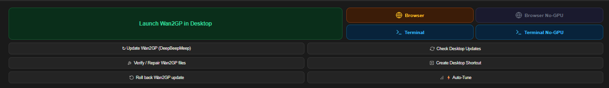

- **Desktop** — Wan2GP embedded in the launcher: reload, zoom 25–200%, hide/show that keeps your session, and console-first boot (the view opens when the dashboard log says it's ready). Drag & drop into Gradio dropzones works, and new gallery arrivals pop a Save / Save As… prompt with real file-type filters.
- **Browser** — visible console, auto-opens when ready.
- **External Terminal** — a real Windows Terminal / cmd window via generated script; in-app LED + Stop.
- **No-GPU Chrome** — launches Chrome with GPU disabled to free VRAM for generation.
- **Browser picker** — detects Chrome, Edge, Firefox, Brave, Opera, Vivaldi.

### Where is everything? (defaults)

Three separate things, three places:

```
1) The launcher app itself (≈ 12 MB)   ← installed by the setup.exe
   %LocalAppData%\Wan2GP Desktop Launcher Tauri\
   Uses the WebView2 engine already in Windows — no bundled Chromium.
   (Machine-wide install goes to Program Files instead.)

2) Wan2GP + launcher data (self-contained, you pick the folder)
C:\Wan2GP\                      ← repo + launcher data
   ├─ wgp.py                    ← Wan2GP core
   ├─ env_uv\                   ← Python 3.11 venv (uv)
   ├─ wgp_config.json           ← settings (ckpts → C:\Wan2GP-Models\ckpts)
   ├─ desktop-config.json       ← launcher config (lives HERE, not in AppData)
   └─ boot.log                  ← diagnostic

3) Your large files (any drive you chose)
C:\Wan2GP-Models\               ← models library
   ├─ ckpts\                    ← checkpoints
   ├─ loras\                    ← LoRAs
   └─ outputs\                  ← generated videos/images/audio
```

> `C:\Wan2GP` / `C:\Wan2GP-Models` are pre-filled defaults — Browse to any drive/folder at install or later via **Dashboard → Migrate to new location**. A custom data folder is remembered in `%USERPROFILE%\.wan2gp-tauri-data-dir` (the old Electron pointer is followed automatically, so your install carries over).

## 🔥 What's New

> Full history with every fix: [CHANGELOG.md](CHANGELOG.md). All releases: [GitHub](https://github.com/GKartist75/Wan2GP-Desktop-Tauri/releases).

| Version | Headline |
| --- | --- |
| [**v0.10.3**](https://github.com/GKartist75/Wan2GP-Desktop-Tauri/releases/tag/v0.10.3) | Long Auto-Tune values stop overlapping neighbouring fields; Restore names what it installed; Sync no longer re-downloads 282 MB of wheels you already have |
| [**v0.10.2**](https://github.com/GKartist75/Wan2GP-Desktop-Tauri/releases/tag/v0.10.2) | Light theme survives a relaunch; Update says *"Already at upstream"* instead of doing a no-op |
| [**v0.10.1**](https://github.com/GKartist75/Wan2GP-Desktop-Tauri/releases/tag/v0.10.1) | **Upstream v17 (MMGP v4) parity** — Profile 4 is up to 50% cheaper in VRAM, and nine new upstream settings are calibrated per hardware instead of left for you to hand-enable |
| [**v0.10.0**](https://github.com/GKartist75/Wan2GP-Desktop-Tauri/releases/tag/v0.10.0) | Internal: renderer split into 35 per-panel files, first test suite, ~2,200 lines of dead Electron code removed |
| [**v0.9.2**](https://github.com/GKartist75/Wan2GP-Desktop-Tauri/releases/tag/v0.9.2) | AMD correctness — RX 9060 / 9060 XT get the right `gfx1200` wheels; memory probing fails toward smaller profiles |
| [**v0.9.1**](https://github.com/GKartist75/Wan2GP-Desktop-Tauri/releases/tag/v0.9.1) | Opt-in console log viewer on its own port (phone included) |
| [**v0.9.0**](https://github.com/GKartist75/Wan2GP-Desktop-Tauri/releases/tag/v0.9.0) | AMD ROCm 10 refresh — unified `AMD` profile, Python 3.12, pinned torch 2.13 |
| [**v0.8.x**](https://github.com/GKartist75/Wan2GP-Desktop-Tauri/releases) | Pin-aware updates, stash-free updates, phone & remote access, queue notifications, plugin manager, DLSS5 |

---

## Screenshots

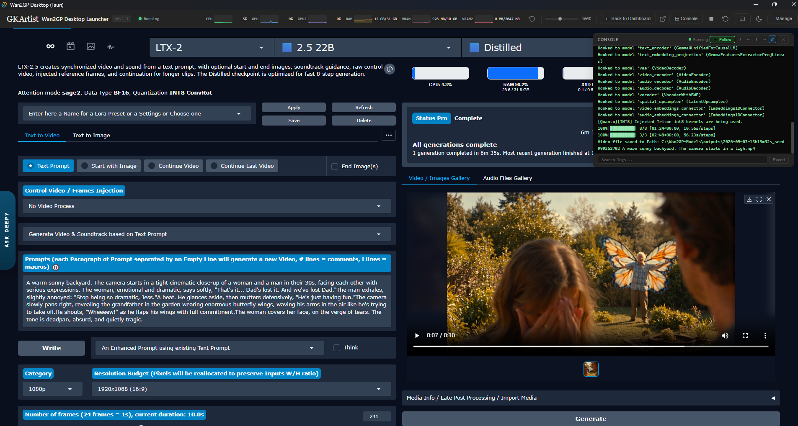
*Desktop view: Wan2GP (LTX-2.5 Distilled) embedded, floating console streaming the live log, topbar CPU/GPU/RAM/VRAM sparklines.*

<table>
  <tr>
    <td><a href="screenshots/autotune-int8.png">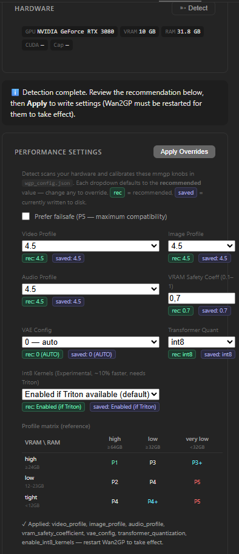</a><br><sub>Auto-Tune — hardware detection with rec/saved tags</sub></td>
    <td><a href="screenshots/env-kernel-wheels.png">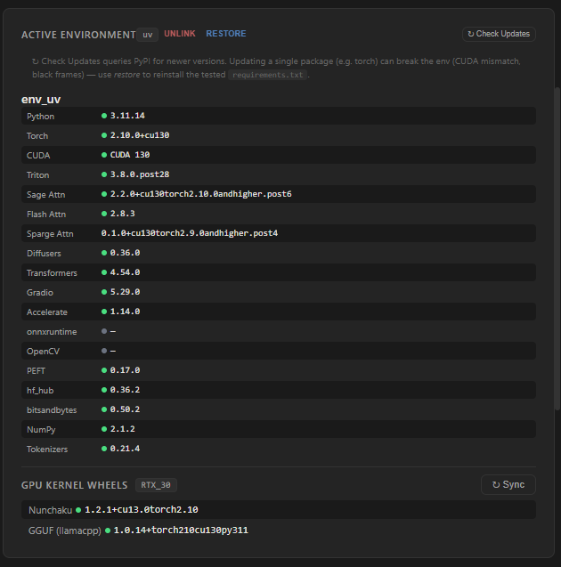</a><br><sub>Active Environment — installed packages and GPU kernel wheels</sub></td>
  </tr>
  <tr>
    <td><a href="screenshots/deepy-prime-engines.png">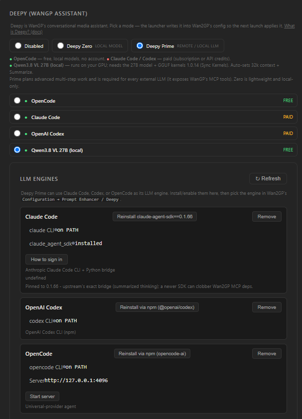</a><br><sub>Deepy Prime — local Qwen3.8 + remote LLM engines</sub></td>
    <td><a href="screenshots/plugins-manager.png">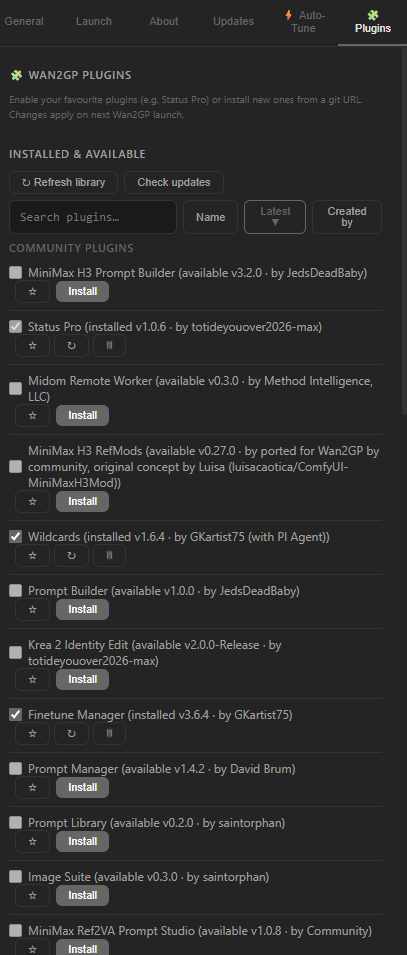</a><br><sub>Plugin Manager — community catalog, install, update, favourites</sub></td>
  </tr>
  <tr>
    <td colspan="2"><a href="screenshots/dlss5-checklist.png">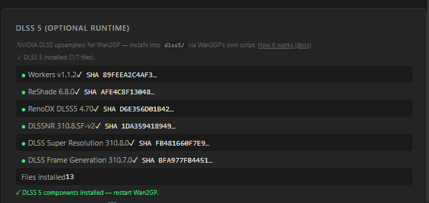</a><br><sub>DLSS5 installer — live per-component checklist with SHA-256 verification</sub></td>
  </tr>
</table>

---

## Why Tauri?

Same launcher, same Wan2GP, same features — lightweight native shell. It uses the **WebView2 engine already built into Windows 10/11** and a compiled **Rust** backend. No bundled browser, no Node runtime.

- Installer download: **≈ 3 MB**
- Installed app: **≈ 12 MB**
- Idle RAM (launcher shell): **~30–80 MB (shared system WebView2)**
- Startup: **near-instant native boot**
- Backend: **compiled Rust (memory-safe, no GC pauses)**
- Updates: **small NSIS/MSI patch**

**What that means for generation:** the launcher is not the part that renders video — but every MB of RAM and VRAM it doesn't waste stays available for models. The Tauri shell idles at a fraction of the footprint, and the **Launcher GPU** setting (Integrated / Disabled-SwiftShader) can push the UI off your NVIDIA card entirely, freeing **1–5 GB VRAM** for Wan2GP.

**Your install carries over:** the entire frontend (dashboard, installer, Auto-Tune, Deepy panels, consoles) is the same HTML/CSS/JS. Your `C:\Wan2GP` install, `C:\Wan2GP-Models` library, `wgp_config.json` and `desktop-config.json` carry over untouched — a custom data-dir pointer is followed automatically.

---

## What you get

**WanGP by [deepbeepmeep](https://github.com/deepbeepmeep/Wan2GP)** is a one-stop super-app for open-source generative models — video, image, audio and TTS — with a full browser UI, queue, galleries, LoRAs, finetunes and plugins. It runs on as little as **6 GB VRAM** and supports old and new GPUs alike. Through this launcher you get the **full WanGP** — same models, same UI, same plugins. Nothing stripped.

| Modality | Supported models (via launcher) |
| --- | --- |
| **Video** | **Wan 2.1 / 2.2** + derivatives, **MiniMax H3** (FL2VA / Ref2VA), **LTX-2 / 2.3 / 2.5**, **HunyuanVideo 1 / 1.5**, **LongCat, Kandinsky, LTXV, MagiHuman, VACE** |
| **Image** | **Krea 2, Qwen Image, Z-Image, Flux 1 / 2** (Klein, Chroma), **SenseNova, Ideogram 4, HiDream, Flux Kontext** |
| **Audio / TTS** | **Qwen3 TTS, AceStep 1/2/XL, Omnivoice, IndexTTS 2/2.5, KugelAudio, HeartMula, Chatterbox, Minimax Music, Stable Audio 3, YuE2, AuK Speech, Scenema Audio, DramaBox** |

**Run on more hardware:** 6 GB VRAM is enough for select models (up to 24 GB+ for max quality). NVIDIA GTX 10xx/16xx, RTX 20xx/30xx/40xx/50xx · AMD RDNA 2/3/3.5/4 · Apple Silicon (via upstream). Quantized checkpoints (int8, fp8, GGUF, NV FP4, Nunchaku) with architecture-aware downloads. Full web UI: galleries, templates, mask editor, background remover, pose/depth/flow, diarization, upsampling (RIFE/FlashVSR/Lanczos/SeedVR2), MMAudio/SeedVC, **20+ community plugins**, LoRAs, finetunes, queue, headless/API mode.

> Upstream docs: [WanGP README](https://github.com/deepbeepmeep/Wan2GP) · [Installation](https://github.com/deepbeepmeep/Wan2GP/blob/main/docs/INSTALLATION.md) · [Models](https://github.com/deepbeepmeep/Wan2GP/blob/main/docs/MODELS.md)

**What the launcher adds:**

- 🚀 **One-click install** — GPU detect → plan → preflight (Python pin, disk space, drivers, folder triage) → live progress. Missing Git/Python/uv installs silently, no PATH editing.
- 🎯 **Always the right kernels** — per-GPU wheels from WanGP's `setup_config.json`, re-synced on install and every update, plus launcher safety overrides (GGUF floor, sage safe build) with one-click pure-upstream Restore.
- 📂 **Clean data layout** — `C:\Wan2GP` (app) + `C:\Wan2GP-Models` (models), both editable to any drive/folder; migrate later via Dashboard → Paths.
- 🖥️ **Flexible launch** — Desktop embed, Browser, or External Terminal; pop-out, zoom, browser picker.
- 🗂️ **A console you can size** — drag the edge that faces Wan2GP to trade GUI space for log space, in every dock (bottom / top / left / right / floating) and on the Dashboard card, up to the whole area below the topbar. Each dock remembers its own size across restarts; **⤢ Full** gives the console the entire dashboard, which is what you want in Browser mode where the console *is* the view.
- 🎨 **5 themes + text sizing** — Mono (default), Blue Sky, Orca, Cyber, Matrix; every theme editable (accent/background/text, live preview, Save/Set-as-default/Reset), topbar palette quick-switch, Text + Terminal size sliders in Manage → Appearance.

<table>
  <tr>
    <td><a href="screenshots/appearance-themes.png">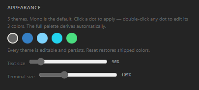</a><br><sub>Appearance — 5 themes, Mono default, click to apply</sub></td>
    <td><a href="screenshots/appearance-editor.png">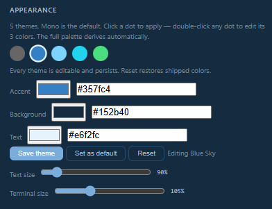</a><br><sub>Appearance editor — 3 colors per theme, Save/Set-as-default/Reset</sub></td>
  </tr>
</table>

- 🔄 **Safe updates** — manual-only, version-aware, from Dashboard / Manage → Updates.
- 🛡️ **Crash-proof UI** — crash recovery restores your session.
- 🧩 **Pinokio coexistence** — Pinokio installs detected and left untouched; one click reuses their model library, no re-downloads.

---

## 🛟 Troubleshooting — upstream's guide, as buttons

**Manage → Troubleshooting** turns WanGP's own `docs/TROUBLESHOOTING.md` into controls instead of copy-paste command lines. Read-only checks first; anything that writes backs up or asks.

| Button | What it does |
| --- | --- |
| **Diagnostics** | CUDA smoke test, real GEMM + INT8 compute check, Triton import, port owner + one-click fix, Windows long-paths status |
| **Failsafe (P5)** | Drops every profile to minimum-compatibility, backs up `wgp_config.json`, sets an SDPA fallback so the next boot works |
| **Known-good settings for this GPU** | Upstream's per-class recipe, shown before anything is written |
| **Out-of-memory remedies** | One click for Head Split → Medium or Lower Reserved RAM with pinning on |
| **Windows VRAM** | *Who is using VRAM* (per-process) and *Trim idle VRAM* |
| **Verbose logging** | Launches WanGP with `--verbose 2` so the console captures upstream's own diagnostics |
| **Debug bundle** | One click copies a report for Discord or GitHub |

**The known-good recipe** per card: `sdpa`/P4 on GTX 10xx · `sage`/P4 on RTX 20xx · `compile`/`sage2`/P3 on RTX 30–40xx · `sage2`/P4 on RTX 50xx. Only keys that really exist in `wgp_config.json` are written — Tea Cache and fp16 have no upstream key, so they are reported as *"set this in WanGP"* rather than saved as settings that would silently do nothing. AMD and Intel get no recipe; upstream publishes none.

**Head Split is a real trade.** Upstream's figure is ~2 GB less VRAM for ≤3% slower steps on H3 1080p/362 frames — same quality, but details and sometimes the motion can differ. Both remedies go through the same validated, backed-up write path as Auto-Tune.

> ⚠️ **Trim idle VRAM** briefly applies memory pressure and the screen can flash — it asks first. *Who is using VRAM* reads `gpumem.cmd`; WDDM hides per-process GPU memory from `nvidia-smi`.

> **Details and full button list:** [User Guide → Manage → System](docs/USER-GUIDE.md#manage--system)

---

## ⚡ Auto-Tune — one click, right profile

**Manage → Auto-Tune** (or ⚡ on the dashboard) reads your GPU, VRAM, RAM and kernels, then recommends the right `wgp_config.json` settings. Detect only proposes — **Apply Overrides** is the only thing that writes, and it refuses while WanGP is running.

**VRAM × RAM profile matrix**

| VRAM ↓ \ RAM → | ≥64 GB | ≥32 GB | <32 GB |
| --- | --- | --- | --- |
| **≥24 GB** | P1 max perf | P3 | P3+ RAM saver |
| **12–23 GB** | P2 | **P4 balanced** | P5 |
| **<12 GB** | **P4** | **P4** | **P4** |

Profiles run 1 (max performance) to 5 (failsafe). Upstream v17 made Profile 4 up to 50% cheaper in peak VRAM, so a card under 12 GB no longer has to drop to the failsafe net — it gets **P4 plus Attention Head Split** instead, which buys ~20% more VRAM for a few percent of speed. **Prefer failsafe** still forces P5 everywhere.

**Two honest caveats.** Attention Head Split does not reproduce the input exactly: same quality, but details — and sometimes the motion — can differ. And most of the v17 gain assumes Sage2 attention, which Auto-Tune does *not* switch for you — that stays yours via Performance Settings or the known-good recipe under Troubleshooting. Head split is on by default because VRAM headroom is the failure mode that stops generation outright; turn it Off in one click if you want bit-identical output.

Audio lands on **P3+** almost everywhere, even where video gets P4 — audio models fit whole in VRAM, where upstream's own default applies. Two deliberate exceptions: P5 follows down, and P1/P3 are left alone.

Settings written: `video/image/audio_profile`, `transformer_quantization`, `int8_kernels`, `kernel_precision`, `vae_config`, `vram_safety_coefficient`, plus the v17 levers (`attention_mode`, `vram_allocator`, `attention_head_split`, `read_ahead`, `smart_memory_pinning`, `*_preload_mode`, `perc_reserved_mem_max`). **These are CUDA-only** — on AMD and Intel Auto-Tune leaves them unset rather than persisting a setting that silently does nothing. Conditions are stated in the panel itself: the allocator needs a restart, pinning reloads the model, head split only engages at ≥8192 tokens.

A fresh install seeds the recommended values once, with setdefault semantics, so day one is already calibrated. An update never re-seeds over settings you tuned.

> **What each setting does, and when to override it:** [User Guide → Manage → Auto-Tune](docs/USER-GUIDE.md#manage--auto-tune)

---


## 📊 Monitoring & control

- **Dockable console** — live server log in green-on-black, dock to bottom/left/top or float. Search, export, **Clear**.
- **Topbar sparklines** — CPU/GPU/RAM/VRAM mini real-time charts.
- **Running LED & Stop** — status light + one-click server stop.
- **Auto-start with Windows**, notifications on server ready/stop.
- **Queue notifications** — sets up Wan2GP's native Apprise destinations (Telegram/Discord/ntfy.sh…) in `wgp_config.json`, Install covers `apprise` + `keyring`; legacy log-driven sender stays for older Wan2GP.
- **Keyboard shortcuts** — <kbd>Esc</kbd>/<kbd>Ctrl+W</kbd> close webview.
- **Maintenance** — update WanGP or the launcher from **Dashboard** or **Manage → Updates**, switch envs, or uninstall from the UI. **Dashboard → Paths** migrates installs between drives.

---

## 🔧 GPU kernels — the right ones, automatically

WanGP is faster with vendor kernels than stock PyTorch. You never pick them: the launcher reads WanGP's own `setup_config.json`, shows you exactly what it will install before it does, and re-syncs on install and after every update.

- **Per-GPU sets** — RTX 20 → Sage 1.0.6 + Nunchaku + GGUF + bitsandbytes · RTX 30/40 → adds Sparge + Sage 2.2.0 · RTX 50 → adds LightX2V FP4 · AMD → ROCm 10 stack, Sage 1.0.6, SDPA default.
- **Versions follow upstream** — a future bump in `setup_config.json` installs with no launcher update. The in-app GPU Kernel Wheels card is always authoritative; this README intentionally does not restate version numbers.
- **Launcher safety overrides** — a GGUF floor and the Sage post6 safe build, both restorable to pure upstream with **Restore GPU Wheels**.
- **Verified, not assumed** — after every Wan2GP update a compat check runs and says so in the Console. Unknown future components skip loudly instead of silently.

> **Full wheel table, per-GPU sets, driver requirements and the AMD/Intel notes:** [User Guide → GPU kernel wheels](docs/USER-GUIDE.md#gpu-kernel-wheels--what-gets-installed-per-gpu)

---


## Deepy — your offline agent

Configure without editing JSON: **Settings → Deepy** or the Dashboard card. Switching re-renders the picker live; **Apply** writes a consistent `wgp_config.json` (with backup).

| Mode | What it is |
| --- | --- |
| **Disabled** | Deepy off. Prompt enhancement still works with any local model (Florence or Qwen). |
| **Deepy Zero** | Local, no account or key. Qwen VL models. |
| **Deepy Prime** | Remote LLM via **OpenCode** (free), **Claude Code** or **Codex** (paid) — or a local **Qwen3.8 VL 9B/27B**. Prime exposes WanGP's MCP tools. |

**New here?** Start with **OpenCode** — the only zero-cost option.

Two more cards on the same screen: **Prompt enhancement** (Enhance Prompt button or Automatic dropdown, works with or without Deepy) and **Sessions** (multisession mode, per-session workspace, gallery media handling).

> **Model sizes, quantization choices and per-engine setup:** [User Guide → Dashboard](docs/USER-GUIDE.md#dashboard)

---


## 📱 Phone & remote access

One panel, three paths — **A** is everyday use, **B** and **C** are optional.

- **A · Gradio server** — flip the LAN (`--listen`) toggle and Gradio `/` plus the phone-friendly `/deepy/` are reachable from any device on your Wi-Fi: same conversation, galleries, progress and queue. This-PC and Phone URLs with Open / Copy / QR.
- **B · Deepy Web standalone** — a second process on its own port with its own conversation. Finish → stop → resume via saved sessions (it never live-syncs with A). Auth, LAN HTTPS, Tailscale, reverse-proxy origin and extra args all live here.
- **C · Console logs** — a read-only tail of the same console as a web page on its own port, so you can watch errors from a phone without stopping the run. Trusted home Wi-Fi / Tailscale only — never port-forward it (no auth).

Flipping LAN while running offers a restart in place. Topbar keeps a Deepy Web LED next to the Wan2GP LED. All actions log `[Deepy]` lines to the Console.


One panel, two paths — pick one. **A · Gradio server** exposes Gradio `/` and the phone-friendly `/deepy/` together over a **LAN (`--listen`) toggle** (persisted, appended verbatim on launch; flipping it while running offers a restart in place): same conversation, galleries, progress and queue on every device, with This-PC and Phone URLs (Open/Copy/QR). **B · Deepy Web standalone** is a second process on its own port with its own conversation — Assistant selector (Zero/Prime per start), Same-PC / Phone-LAN addresses plus an **External** Tailscale row (Copy + QR), Auth (Off / fixed passphrase with generator), port (empty = auto, server port + 1), LAN HTTPS, reverse-proxy origin, Extra args, Start/Stop. Standalone never live-syncs — finish → stop → resume via saved sessions. Address URLs are click-to-open in the real browser (login must happen in a tab — embedded views 403). Topbar shows a persistent Deepy Web LED (green = running, red = stopped) next to the Wan2GP LED. All actions log `[Deepy]` lines to the Console. Left info cards collapse (chevron, remembered) while keeping key actions live in the header.

<table>
  <tr>
    <td><a href="screenshots/deepy-web-phone-app.jpg">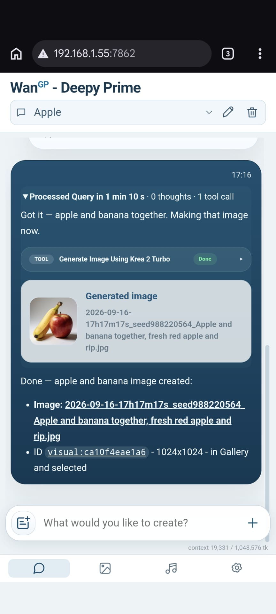</a><br><sub>Deepy Web on a phone — Prime session generating an image</sub></td>
    <td><a href="screenshots/deepy-web-desktop-prime.png">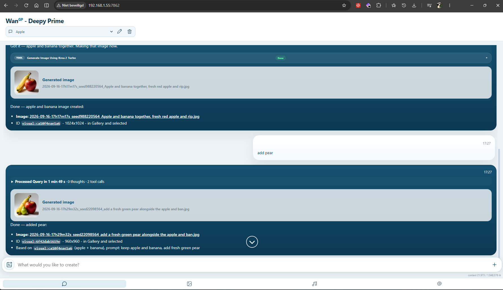</a><br><sub>Deepy Web on desktop — Prime multi-turn session with follow-up edit</sub></td>
  </tr>
  <tr>
    <td><a href="screenshots/deepy-web-settings.png">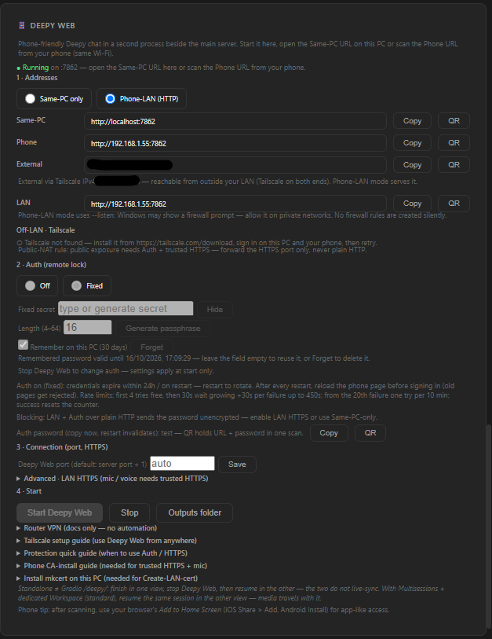</a><br><sub>Deepy Web card — addresses, auth, connection, start</sub></td>
    <td><a href="screenshots/deepy-prime-panel.png">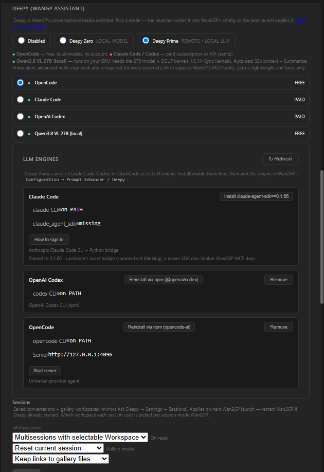</a><br><sub>Deepy Prime panel — engine picker, LLM engines, sessions</sub></td>
  </tr>
  <tr>
    <td colspan="2"><a href="screenshots/deepy-zero-panel.png">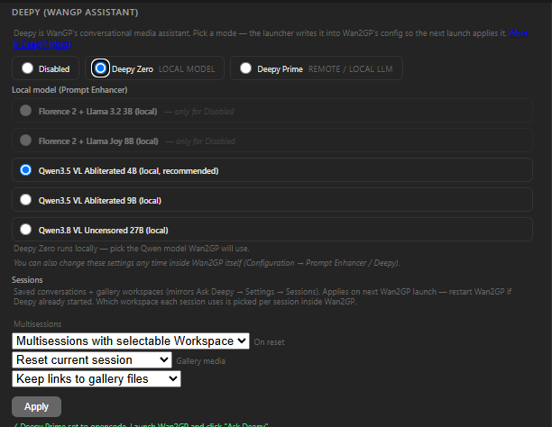</a><br><sub>Deepy Zero panel — local Qwen model picker</sub></td>
  </tr>
</table>


---

## 🧩 Plugin Manager

**Manage → Plugins** lists WanGP's catalog merged with your installed `plugins/` folder (system vs community grouping), with search, Name/Latest/Author sort, and per-plugin enable checkboxes. From a git URL you can install (clone + `requirements.txt` + enable), per-plugin ↻ check/update, 🗑 uninstall, library refresh, and check-all-updates — all with console progress.

- **Status Pro** is uninstalled by default (temporarily incompatible with the current Deepy update): no longer auto-installed or force-enabled, and removed from existing installs — reinstall/enable it manually once fixed.
- **★ Favourites** auto-install on fresh setup (stored in `desktop-config.json` → `favoritePlugins`).
- Changes apply on next Wan2GP launch.

<a href="screenshots/plugins-manager.png"></a>

## ✨ DLSS5 installer — optional NVIDIA upsamplers

Dashboard card runs WanGP's own `scripts/install_dlss5.ps1` (workers v1.1.3, ReShade 6.8.0, RenoDX 4.70, DLSSNR 310.8.SF-v2, DLSS 310.8.0, Frame Generation 310.7.0) into `C:\Wan2GP\dlss5\` with a live per-component checklist — downloading → SHA-256 ✓ → installed — plus console progress.


- Strict consent: type `I ACCEPT` (third-party binaries are community-hosted, unsigned, proprietary — see [docs/DLSS5.md](https://github.com/deepbeepmeep/Wan2GP/blob/main/docs/DLSS5.md)).
- **Force** backs up + replaces conflicting files. **Stop Wan2GP first.**
- Needs Windows 11 + RTX 30+ (Neural Rendering, 30 experimental) / RTX 40+ (Frame Generation) + HAGS.
- **Check compatibility** reports per-mode verdicts (ready / not-installed / blocked) with GPU tier, files, HAGS, and the frame-gen probe.
- **Workstation GPU fix** (opt-in) — patches WanGP's GeForce-only GPU check so RTX PRO / Ada / RTX Ax000 / L40 / Hopper cards pass DLSS gating. Backed up (`*.launcher-bak`), reversible, refuses on upstream drift.

> ⚠️ **Untested on real workstation hardware** — the tiers logic are simulated only (PRO 5000→50, 5000 Ada→40, A6000→30). Confirm on a PRO/A-series card before relying on it.

---

## 🧭 Guide & 📚 Library

**Guide** (topbar tab, next to Manage) answers *what to make and with what*: goal picker with curated model picks + starter settings (copy the full model name into WanGP's toolbar search), 6 prompt templates with the line mode each needs, offline `[/...]` window-command checker, VACE pre-flight checklist, post-processing at a glance. Read-only — nothing changes until you pick inside WanGP. Full walkthroughs: [docs/WAN2GP-GUIDE.md](docs/WAN2GP-GUIDE.md) — all 232 models and 116 settings.

**Manage → Library** inventories what's on disk: downloaded checkpoints (sizes + kind tags), LoRA families (files/size/known URLs), finetunes (import validated JSON, export to share, delete), workspaces (real sizes, missing-file flags, archive lock, definitions backup).

### Gallery viewer

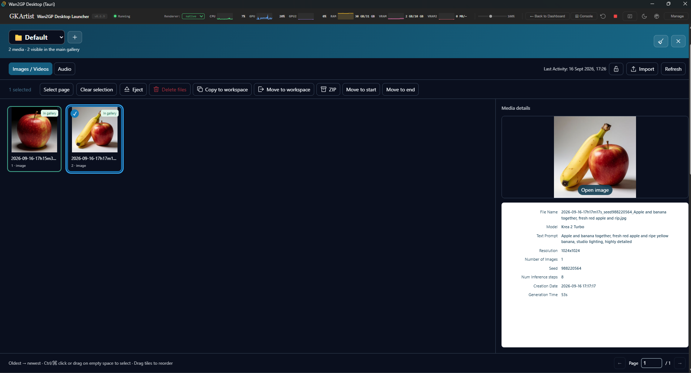

Full workspace viewer: multi-select, reorder, eject, copy/move across workspaces, ZIP download, import, delete (confirmed), media-details pane with prompt/model/settings. New arrivals pop Save / Save As… with proper `*.zip`/`*.json` filters.

**Manage → Launch** adds presets (Balanced / Low VRAM / Max perf / Emergency) + flag builder, an MCP command/URL helper, and a headless queue runner (`--process` with console streaming). **Manage → System** adds torch/CUDA probes to the issue bundle, config snapshots on every Apply (undoable restore), upstream changelog viewer, and Deepy engine checks.

---

## Documentation

| Doc | For |
| --- | --- |
| [**User Guide**](docs/USER-GUIDE.md) | Every screen, tab and button — where things are and what they do |
| [**WanGP Guidance**](docs/WAN2GP-GUIDE.md) | Which model and settings to pick for your goal |
| [**System Overview**](docs/OVERVIEW.md) | How the launcher, upstream WanGP and your machine fit together — for contributors |
| [**CHANGELOG**](CHANGELOG.md) | Every fix, per release |

---

## 🛠 Build from source

Prerequisites: [Rust](https://rustup.rs/) (1.77.2+) + Node.js. WebView2 comes with Windows.

```bash
git clone https://github.com/GKartist75/Wan2GP-Desktop-Tauri.git
cd Wan2GP-Desktop-Tauri
npx tauri build      # NSIS + MSI in src-tauri/target/release/bundle/
```

Backend lives in `src-tauri/src/lib.rs` (`#[tauri::command]` handlers); frontend is vanilla HTML/CSS/JS in `src/` calling them via `invoke()` (`src/w2gp.js` bridge).

### Tests

```bash
cargo test --manifest-path src-tauri/Cargo.toml --lib   # 256 backend tests
npm test                                               # 37 frontend tests
```

Both suites are hermetic — the backend one redirects `get_repo_dir()` at a
tempdir, so running it leaves your `C:\Wan2GP\wgp_config.json` untouched.

### Working on the UI

`src/app.js` is the shell; each panel lives in its own `src/*-tab.js`, all
listed in `index.html` after `app.js`. **That order is a contract** — a script
cannot reference a symbol a later script defines, because all scripts are
`defer` and therefore run in document order. `tests/load-order.test.js` enforces
it. To see a panel without a full build:

```bash
npm run harness          # serves src/ on http://127.0.0.1:4173 with Tauri IPC stubbed
```

---

## ⭐ Star History

If this launcher saved you a setup headache, leave a star — it helps others find it.

[](https://www.star-history.com/#GKartist75/Wan2GP-Desktop-Tauri&Date)

---

## Credits & License

Wan2GP Desktop Launcher wraps [Wan2GP](https://github.com/deepbeepmeep/Wan2GP) by deepbeepmeep.

Discord: [WanGP Community](https://discord.gg/g7efUW9jGV) · X: [@deepbeepmeep](https://x.com/deepbeepmeep) · Site: [wangp.ai](https://wangp.ai/)
