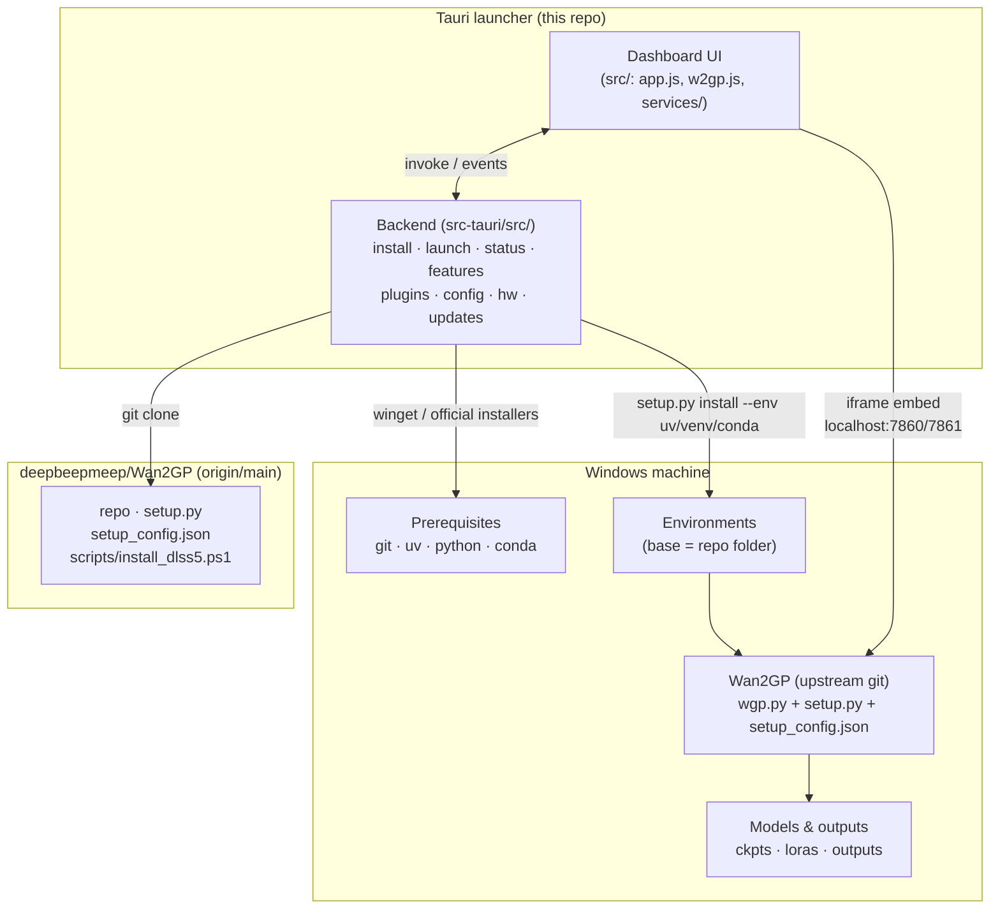
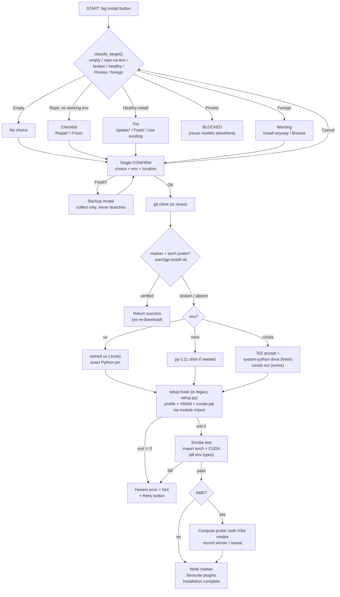
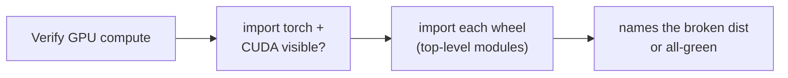
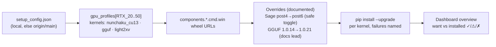
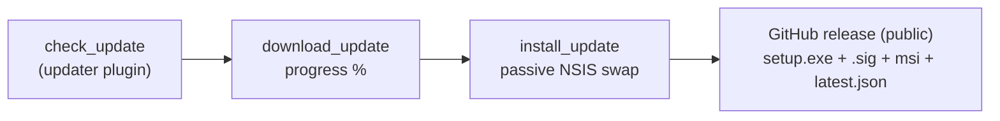

# Wan2GP Desktop Launcher — System Overview

How the launcher, upstream Wan2GP, and the machine fit together. For the
user-facing feature list see [README.md](../README.md); for per-version
history see [CHANGELOG.md](../CHANGELOG.md).

## Architecture

Trust rule: **upstream owns** the profile→package mapping (`setup.py`,
`setup_config.json`) and all model/runtime code. **The launcher owns**
detection, provisioning, honesty (exit codes, smoke tests), and lifecycle
(start/stop/update). The launcher mirrors upstream data, never overrides it —
except where upstream lags its own docs (GGUF 1.0.21), declares data nothing
consumes (HSA override), or ships a template that breaks its own installs
(conda `conda run` re-quoting corrupts wheel URLs → direct-pip patch); all
are documented at the call site, drift-refusing, and auto-follow upstream flips.

Tooling rule: **never depend on PATH.** uv lives owned in `<dataDir>\.tools`
(self-updating receipted copy); env interpreters, git/conda/python resolve to
absolute known locations with PATH only as fallback. Fresh prerequisite
installs are usable instantly — no restart.

## Install pipeline (big Install button — the ONLY launcher)

User-facing version with screenshots-level detail: [USER-GUIDE.md](USER-GUIDE.md).

Key properties: the big Install button is the only launcher (radios and
modals never start work); one adaptive confirm per run; no step reports
success it didn't earn; every failure names the failing command plus a
copy-paste fix; Retry never re-downloads a finished install and never resumes
into a half-built env; cancelling anywhere returns to the ticked choice.

## Verify (System → Troubleshooting)

Version-present is not loadable (AV quarantine, wrong-torch ABIs) — Verify
proves imports and names the culprit. Run after AV restores, driver updates,
or env surgery.

## Kernel sync (Manage → Sync Kernels)

## Update flow (launcher itself)

Manual-only: check emits `available{autoDownload:false}`; nothing downloads
or installs without the user's explicit Full Download → Install & Restart.
