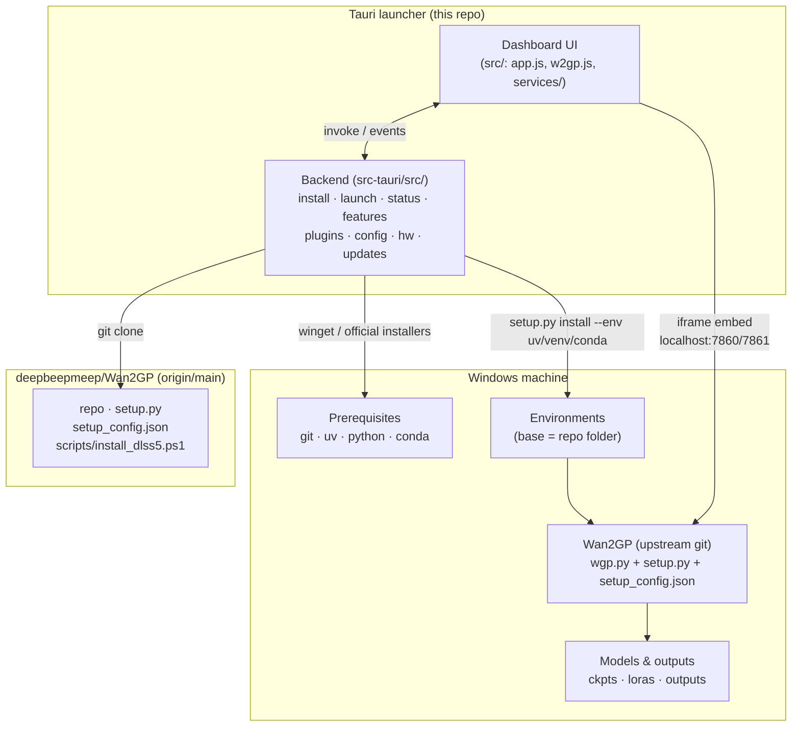
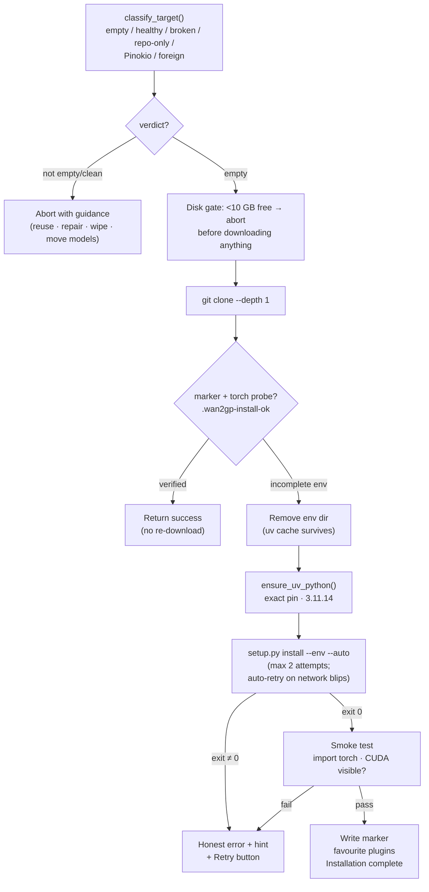
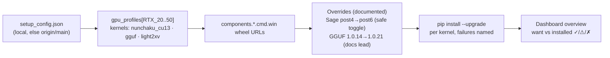
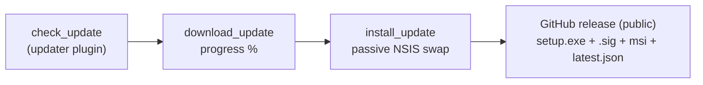

# Wan2GP Desktop Launcher — System Overview

How the launcher, upstream Wan2GP, and the machine fit together. For the
user-facing feature list see [README.md](../README.md); for per-version
history see [CHANGELOG.md](../CHANGELOG.md).

## Architecture

Trust rule: **upstream owns** the profile→package mapping (`setup.py`,
`setup_config.json`) and all model/runtime code. **The launcher owns**
detection, provisioning, honesty (exit codes, smoke tests), and lifecycle
(start/stop/update). The launcher mirrors upstream data, never overrides it —
except where upstream lags its own docs (GGUF 1.0.21) or declares data nothing
consumes (HSA override); both are documented at the call site and auto-follow
upstream flips.

## Install pipeline (fresh Install button)

Key properties: no step reports success it didn't earn; every failure names
the failing command plus a copy-paste fix; Retry never re-downloads a finished
install and never resumes into a half-built env.

## Kernel sync (Manage → Sync Kernels)

## Update flow (launcher itself)

Manual-only: check emits `available{autoDownload:false}`; nothing downloads
or installs without the user's explicit Full Download → Install & Restart.
