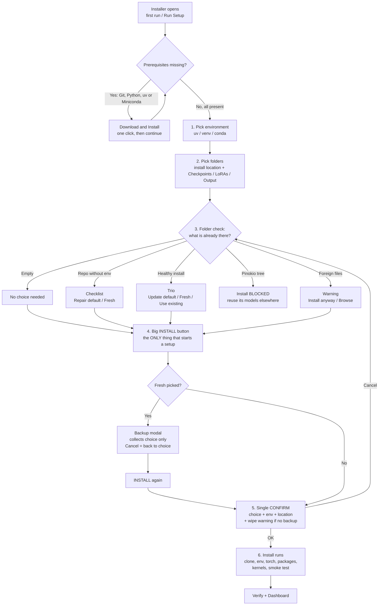

# Wan2GP Desktop Launcher — User Guide

Every screen, tab and button, and what it does. The launcher has three screens
(**Splash → Dashboard → Installer**) plus the **Manage** panel and the embedded
**Viewer**. Companion: [WanGP Guidance](WAN2GP-GUIDE.md) — which model and
settings to pick for your goal.

## Contents

- [Dashboard](#dashboard)
- [Installer (Setup)](#installer-setup)
- [Viewer (Desktop embed)](#viewer-desktop-embed)
- [Manage → General](#manage--general)
- [Manage → Launch](#manage--launch)
- [Manage → System](#manage--system)
- [Manage → Plugins](#manage--plugins)
- [Manage → Auto-Tune](#manage--auto-tune)
- [Manage → Library](#manage--library)
- [Guide (topbar)](#guide-topbar)
- [Console & logs](#console--logs)
- [Typical workflows](#typical-workflows)

---

## Dashboard

The home screen. Top to bottom:

**Top bar**

| Button | What it does |
| --- | --- |
| ← Back to Dashboard | Leaves the Viewer, back to this screen |
| ⊞ Console | Toggles the floating terminal console |
| ⟳ (reload icon) | Reloads the Wan2GP view |
| ⏹ Stop All | Stops Wan2GP + OpenCode servers (also kills the port listener) |
| Task Manager | Opens Windows Task Manager |
| ☀/☾ | Toggles dark / light theme |
| 🎨 (palette) | Cycles the 5 Appearance themes (Mono → Sky → Orca → Cyber → Matrix) |
| ⚙ (gear) | Opens the Manage panel |

**Banners** (appear only when relevant):

- **Update available** — *Full Download* (complete package, always works, fixes corrupted installs), *Install & Restart* (incremental update), ✕ dismiss.
- **Dependency drift** — packages missing or outdated after a Wan2GP update (first few named); *Restore now* reinstalls the pinned set, *Dismiss* snoozes it until the next update.
- **SageAttention fix** (RTX 40/50 only) — the shipped Sage wheel has a known fp8 bug (false out-of-memory / stalling); *Sync Kernels* installs the stable build, *Dismiss* hides it.
- **Models location warning** — your data sits inside the roaming AppData profile; *Migrate to new location* moves it out.

**System card** — CPU, RAM, GPU, VRAM, GPU profile badge. Read-only health summary.

**Paths & Model Folders card** — where everything lives:

- *Wan2GP install location* — repo + Python env + settings. Folder icon opens it in Explorer, pencil icon moves it.
- *Checkpoints / LoRAs / Output* — model and output folders, each with open + change buttons.
- Keep models OUT of AppData/Roaming (tens–hundreds of GB, roams with your profile).
- New models are large (e.g. Qwen Image 2.1 ships bf16 + int8 safetensors plus encoder/VAE) and download on first use; the first H3 INT8 run also fetches its ConvRot VAE. Pre/post-processing checkpoints download on demand (upstream JIT), so the upfront footprint stays smaller than it looks.

**GPU Kernel Wheels card** — per-GPU wheels (torch, triton, sage/flash attention, nunchaku/GGUF) with installed versions. *↻ Update GPU Wheels* installs upstream's wanted set plus launcher fixes (sage safe build, GGUF 1.0.22 floor), *Restore GPU Wheels* reinstalls deepbeepmeep's pure upstream set. Sync follows your local checkout — if it is behind `origin/main`, the console warns you to update Wan2GP first, otherwise you install stale wheels.

**Active Environment card** — the selected Python env (`uv`, `venv` or `conda`):

| Button | What it does |
| --- | --- |
| unlink | Removes the env from the launcher (asks first) |
| restore | Re-installs all packages from `requirements.txt` into the existing env (asks first) |
| reinstall | Recreates the whole env from scratch — fresh Python, PyTorch, packages, kernels. Models, plugins and settings are kept (asks first, takes a while) |
| 🧭 Run Setup | Shown when no env is active — opens the installer for a fresh setup |
| ↻ Check Updates | Checks PyPI for package updates for this env |

**Deepy card** — the WanGP assistant. Modes: Disabled / Deepy Zero (local Qwen model)
 / Deepy Prime (remote LLM or local Qwen3.8 27B). *Local model (Prompt Enhancer)*
 offers all five local models — Florence 2 + Llama variants and Qwen3.5 4B/9B +
 Qwen3.8 27B — in both Disabled and Zero (the enhancer runs standalone without
 Deepy); Qwen engines show a *Quantization* picker (GGUF Q4 / IQ3_S / Q2 /
 Bonsai PTQ1 for 27B, Quanto Int8 / GGUF Q4 for 3.5; Bonsai also sets INT8 KV
 cache). *LLM Engines* lists backends (Claude Code CLI,
OpenCode, …) with *↻ Refresh* to re-check status; pick one and press *Apply*.
*Sessions* below it mirrors Ask Deepy → Settings → Sessions: multisessions mode
(Disabled / selectable Workspace / dedicated Workspace — selectable is the
launcher default, one shared outputs folder), reset behavior, gallery media
(keep links vs copy into session). Per-session workspace choice stays inside WanGP.

**Prompt enhancement card** (below Active Environment, above Deepy) — *Enhancement UI*:
*Enhance Prompt button* (default) or *Automatic dropdown* on Wan2GP generation
forms. Works with or without Deepy, with its own *Apply* (same coherent config
write as the Deepy card).

**Deepy Web card** — phone-friendly Deepy in a second process. *Assistant*:
Zero or Prime per start (applied via Apply — fixes the external-process-boots-Zero
issue). *1 · Addresses*: Same-PC, Phone (same Wi-Fi), plus an *External* row
with the Tailscale IPv4 URL (Copy + QR) for off-LAN access — needs Tailscale on
both ends and Phone-LAN mode to serve it. Address URLs are click-to-open in the
real browser (login must happen in a tab — embedded views 403). Topbar shows a
persistent Deepy Web LED (green = running, red = stopped) next to the Wan2GP LED.
*2 · Auth*: fixed passphrase (generator allows length 4–64, remember
30 days optional). *3 · Connection*: port + LAN HTTPS under Advanced
(bring/create cert, CA guide). Upstream reference:
`docs/AUTHENTICATION.md` in the Wan2GP repo (web login, `--public-url`
reverse-proxy origins, certificates, MCP OAuth). All actions log `[Deepy]` lines to the Console.

**DLSS 5 card** — optional NVIDIA upsampler runtimes. *Install DLSS 5…* opens a
confirmation (Cancel / Install).

**pip install row** — install any extra PyPI package into the active env, with a
copy button for the equivalent command.

**Launch buttons** — start Wan2GP:

| Button | Mode |
| --- | --- |
| App/Desktop (green) | Embedded Viewer inside the launcher |
| Browser | Opens your browser when the server is ready |
| Browser No-GPU | Launches Chrome with GPU disabled to free VRAM for generation |
| Terminal | Real Windows Terminal / cmd window |

**Action row** — *Wan2GP Updates* (upstream version management, ends with a
one-line verdict: upstream commit + local-edit count + untouched personal files,
proving the checkout is 100% original git), *Verify / Repair
Wan2GP files* (read-only drift check against upstream, then tracked-only
repair — settings/models/envs untouched, Pinokio refused), *Check updates*
(launcher version), *Desktop shortcut*, *Roll back Wan2GP update* (one-click
return to the recorded upstream commit, dirty-tree guarded), *Auto-Tune shortcut*.

**Console card** — live launcher + install/launch log with follow toggle.

---

## Installer (Setup)

Opened on first run, via 🧭 Run Setup, or Manage → Run Setup again.

1. **Prerequisites card** (only if something is missing) — Git / Python / uv /
   Miniconda. *Download & Install* fetches it silently, *How to install manually*
   opens the vendor page. Fresh tools work immediately — no launcher restart.
2. **Environment** — pick `uv` (fast, recommended), `venv` (bundled with Python)
   or `conda` (needs Miniconda — one-click install; its terms are accepted
   automatically during setup). All three end up identical: same pinned Python,
   same torch stack, same smoke test.
3. **Install location + model folders** — repo/env/settings folder plus
   Checkpoints, LoRAs and Output folders, each with Browse / reset-to-default.
   Bare drive roots auto-resolve to `<root>\Wan2GP`.
4. **Install location check** — triage of what's already in the folder:
   - *Empty folder* → nothing to decide, just Install.
   - *Repo without a working env* → tick one of two radios (**Install / repair
     environment**, keeps models & settings — pre-ticked; or **Fresh repo**,
     wipes code and keeps models via the backup flow), then press Install.
   - *Healthy install* → trio radios (**Update & keep files** — pre-ticked;
     **Reinstall (fresh)**; **Use existing**), then press Install.
   - *Pinokio tree* → Install is blocked; *Reuse its models in a fresh install*
     points your model folders at the Pinokio library, then pick an empty folder.
   - *Foreign files* → Install anyway (not recommended) or Choose empty folder.
5. **Install button** (below the checks — the only thing that ever starts a
   setup) — one adaptive are-you-sure dialog (choice, env type, location,
   wipe warning when wiping without backup, ~5–20 min + several GB).
   Fresh-repo takes two presses: Install → backup modal (collects the choice)
   → Install → confirm → run. Cancel anywhere stops everything.
6. Below: **hardware summary**, **GPU Profile Overview** (Python, Torch/CUDA,
   Triton, attention backends, kernel wheels), **expected packages**, **live
   download rows**, **resolved install stack** with *Validate installation* and
   *Copy diagnostics* (hardware + paths + checks + log tail for Discord/GitHub).

---

## Viewer (Desktop embed)

Wan2GP itself, embedded as a tab. Behaves like the browser version:

- Drag & drop image/video/audio files from Explorer straight into Gradio inputs
  (reference images, etc.).
- New gallery arrivals pop a **Save / Save As…** prompt — Save keeps the file in
  Downloads, Save As… opens the native dialog with the real file-type filter
  (`*.zip`/`*.json`/… — issue #29) and reopens at the last-used folder.
- Reload, zoom 25–200%, hide/show keeps the session alive.

---

## Manage → General

- **GitHub Token** — optional, avoids API rate limits for updates/changelog (Save / Clear).
- **HuggingFace Token** — optional, needed for gated models; passed as `HF_TOKEN` on launch.
- **Claude / Anthropic API Key** — for Deepy/Claude paths.
- **Default Browser** — which browser Browser-mode opens.
- **Floating Terminal Default** — where the console docks (bottom/left/top/right/minimised).
- **Appearance** — 5 themes (Mono default, Blue Sky, Orca, Cyber, Matrix):
  click to apply, double-click to edit 3 colors (accent/background/text) with
  live preview, Save theme / Set as default / Reset to shipped colors. Text size
  (85–130%) + Terminal size (85–150%) sliders; console window follows.
- **Desktop** — desktop shortcut + start options.
- **Queue Notifier** — optional ping (via Apprise) when generations finish.
- **Xet Storage (hf_xet)** — fast HuggingFace downloads toggle.
- **GGUF CUDA Kernel** — llama.cpp CUDA offload switch.
- **Repair Settings** — resets launcher settings to defaults.
- **AMD ROCm** (AMD only, applies on next launch) — *Disable MIOpen* leaves
  `MIOPEN_FIND_MODE` fully unset (the upstream guide's `cudnn.enabled = False`
  alternative). Try it if generation crashes with MIOpen/HIP errors while the
  default `FAST` mode is set.

## Manage → Launch

- **Share Link** — Gradio public tunnel (only if localhost isn't reachable; your server becomes internet-visible).
- **Presets & flag builder** — Balanced / Low VRAM / Max perf / Emergency preset buttons stage a known-good arg string; attention/profile/teacache dropdowns + compile/fp16 toggles patch single flags. The Extra Launch Args field below updates — press **Save**.
- **Agent API (MCP server)** — transport/host/port/version picker shows the exact launch command + client URL, with copy. stdio = local spawn; HTTP needs `--mcp-auth` + HTTPS off-localhost.
- **Headless batch** — queue `.zip`/settings `.json` path + optional output dir + dry-run → runs `wgp.py --process` with console streaming; exit 0 = done, 1 = error.
- **Extra Launch Args** — appended to `wgp.py` verbatim.
- **Server Port** — default 7860.
- **GPU Device** — `auto` or a pinned `cuda:N` for generation.
- **Launcher GPU** — which GPU the launcher UI itself prefers.
- **SageAttention wheel** — which Sage build to use.
- **Bind Address** — `localhost` (matches Gradio's self-check) vs strict `127.0.0.1` for proxy/VPN setups.

## Manage → System

- **Wan2GP Desktop Launcher** — launcher version + update state.
- **Legacy Electron Launcher** — one-click removal of the old launcher (data kept).
- **Updates** — manual-only, version-aware launcher updates. The updater is
  fetch-first (shows how many changes are incoming), auto-stashes a dirty tree
  around the pull with recoverable restore, and reports step-named errors.
- **Wan2GP (DeepBeepMeep)** — upstream version + update controls. Every
  update/repair/clone records the upstream commit, so *Roll back Wan2GP
  update* (Dashboard action row) can return to it later. Updates also show
  the full requirements check: per-pin ✓/✗ lines plus the pin diff.
- **Setup** — re-opens the installer (fresh / repair / migrate).
- **🛟 Troubleshooting** — **Verify GPU compute** (proves torch + each kernel wheel
  actually *import*, naming the broken dist — run after AV restores, driver
  updates, or env surgery), GPU report, emergency fallback torch probe.
  Links out to upstream `TROUBLESHOOTING.md` (plus `INSTALLATION.md`).
- **🐞 Report an issue…** — support ZIP: system info, torch/CUDA + triton/sage probes, staged launch args, redacted `wgp_config.json`, boot log, crash queue. Opened in Explorer next to a pre-filled GitHub issue.
- **Config backups & changelog** — every Apply snapshots `wgp_config.json` (newest 5); restore re-snapshots first so it is undoable. Upstream changelog head viewer.
- **Deepy engine checks** — OpenCode/Claude/Codex binary presence + `claude-agent-sdk==0.1.66` pin check.
- **Network & TLS flags** — `--public-url` origin validator + cert/key/https-port staging into Extra Launch Args.
- **Emergency Failsafe** — last-resort recovery when nothing launches.
- **Server Port** — port conflict detection / override.
- **Debug Bundle** — copies full diagnostics (hardware, paths, checks, log tail).
- **Triton / SageAttention** — attention-backend controls.
- **SageAttention 3** — deliberately not installed by ↻ Update GPU Wheels and not offered: it needs
  a Blackwell GPU *and* Python ≥ 3.12 (launcher envs are 3.10/3.11), and it refuses
  older cards at runtime even when imported. Verify reports a stray `sageattn3`
  install as inert-but-harmless instead of failing. Sage 2.2.0 stays the synced wheel —
  and 2.2.0 already contains the SageAttention2++ kernels as its default `sageattn`
  path (0.19 ms/iter proven on RTX 3080, 2.5× the explicit fp16 kernel), so non-Blackwell
  cards already run the fastest available attention with nothing to configure.
- **uv Wheel Cache** — cache location / cleanup.

## Manage → Plugins

- **Installed & Available** — plugin list with enable/disable/install/remove.
- **Install from URL** — sideload a plugin from a link.
- **★ Favourites** — starred plugins auto-install on fresh setup (stored in
  `desktop-config.json`). Nothing auto-installs otherwise: plugins come only
  from your favourites.

## Manage → Auto-Tune

⚡ **Performance Auto-Tune** — one click: detects your GPU and applies the right
profile (precision, attention backend, memory knobs). Re-run after GPU/driver changes.

## Guide (topbar)

🧭 **Guide button (topbar, next to Manage)** — opens its own side panel, not a
Manage tab: pick a goal, get curated WanGP model picks with starter settings
and a copy-model-id button. Read-only: nothing changes until you pick the
model inside WanGP. Full walkthroughs: `docs/WAN2GP-GUIDE.md`.

✍️ **Prompt tools** — 6 starter templates (scene/motion/edit/dialogue/lyrics/
window beats) with the WanGP line-mode each needs, copy button, and an offline
`[/duration /overlap /new_shot /loras_mult]` checker.

✅ **VACE pre-flight + post at a glance** — static checklists: control/mask/
reference setup, Skip-Layer-Guidance rule, reference roles, upsampler/audio
method syntax with hardware requirements.

## Manage → Library

📚 **LoRA & Finetune Library** — per-family LoRA file counts, sizes and known
download URLs (`loras_url_cache_v2.json`); finetune list with base architecture
and URL/LoRA counts, plus import (validated, never overwrites), export
(download JSON to share) and delete. Refresh Model List in WanGP afterwards.

**Workspaces** — per-project media counts, real on-disk sizes, moved/missing
file flags, archive-lock toggle, definitions backup ZIP (back up outputs too
for a portable archive).

---

## Console & logs

- Dashboard **Console card** and the installer console stream everything.
  Upstream child lines (Wan2GP server, setup) carry a `[wan2gp]` prefix so you
  can tell launcher lines apart from app lines.
- **Export** saves the log to a file; **Copy diagnostics** (installer stack +
  System tab) puts the full report on the clipboard for Discord/GitHub.
- The floating console docks bottom/left/top/right, floating, or minimised
  (Manage → General → Floating Terminal Default).

---

## Typical workflows

- **First install:** Dashboard → 🧭 Run Setup (or auto-opened) → pick env type →
  accept folders → Install → confirm → Launch (App).
- **Broken env, keep models:** Active Environment → *reinstall* (or installer →
  tick repair → Install → confirm).
- **Wan2GP update:** Dashboard → Wan2GP Updates (manual, version-aware,
  full requirements report in the log).
- **Repo files look edited/corrupt:** Dashboard → *Verify / Repair Wan2GP
  files* (read-only report first; repair stashes recoverably, restores
  tracked files only).
- **Update broke something:** Dashboard → *Roll back Wan2GP update* (returns
  to the recorded commit; refuses on dirty tracked files — Verify/Repair
  first).
- **Something's wrong:** System → Verify GPU compute, then Copy diagnostics /
  Debug Bundle and paste it in Discord/GitHub.
- **Moving house:** Paths card pencil icons (or installer Migrate) — models,
  plugins and settings survive.
