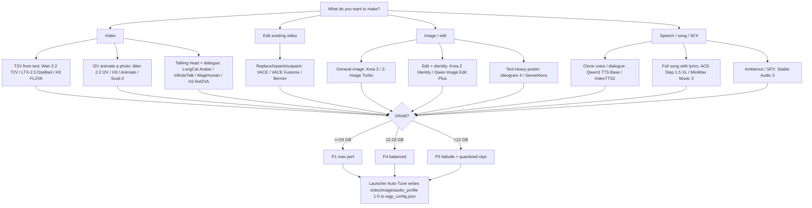
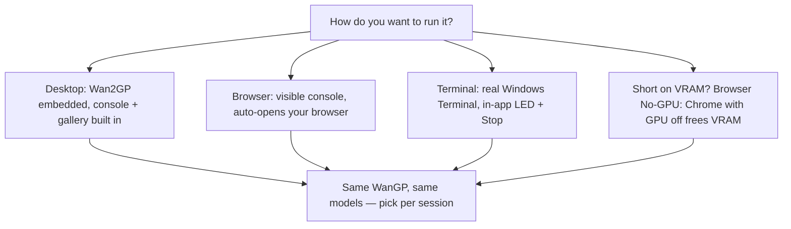
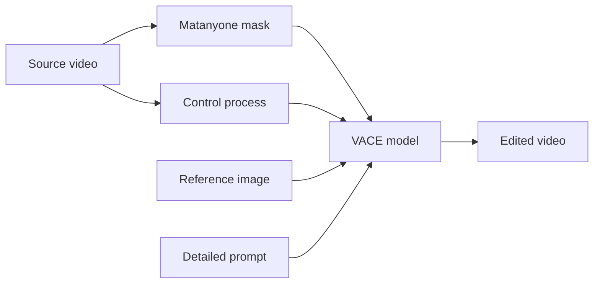
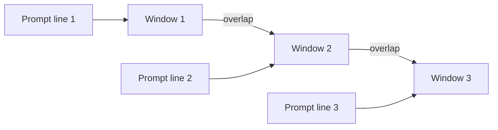
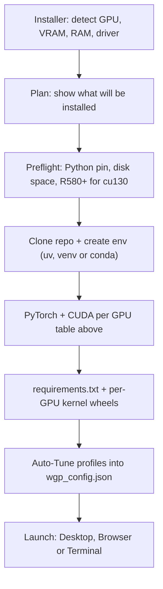
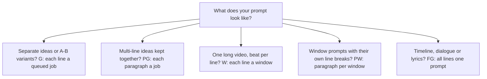
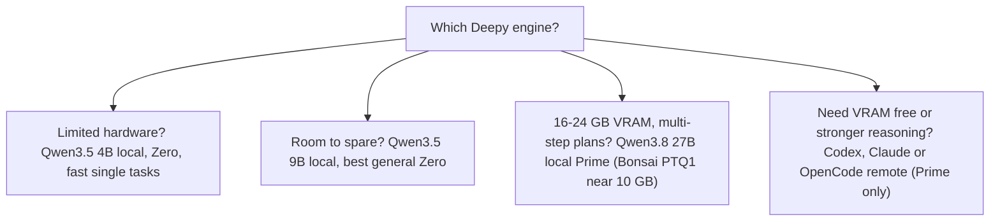
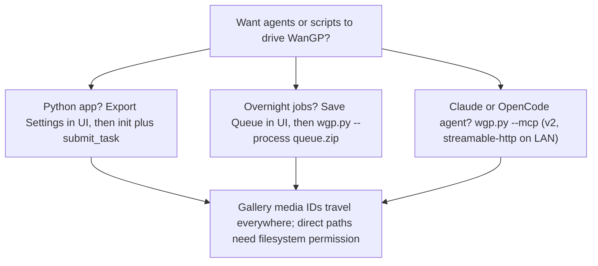
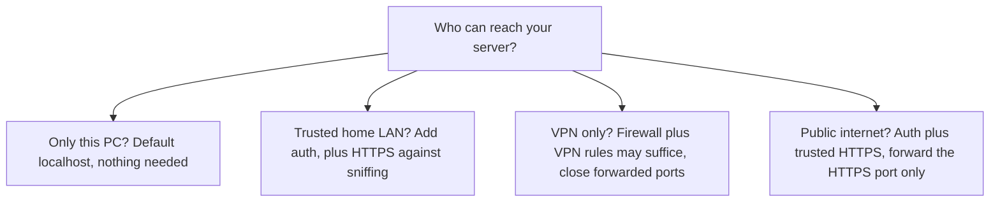
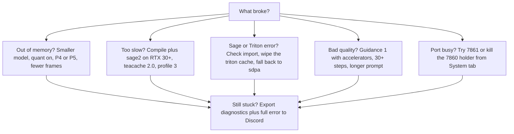

# WanGP Guidance — what to pick, and where to click (launcher vs WanGP)

Companion to `USER-GUIDE.md` (launcher screens/buttons). This guide answers
the *WanGP-side* question: which model, profile, LoRA, prompt mode and
post-processor for your goal — and whether you set it in the **launcher** or
in **WanGP's web UI**. Diagrams are Mermaid (renders on GitHub), choices are tables.

Upstream truth: model selector in WanGP, `defaults/*.json`, `profiles/*/*.json`,
`shared/cli_args.py`, `wgp_config.json`. Launcher never edits your WanGP checkout.

## Contents

- [Start here: goal -> model -> profile](#start-here-goal---model---profile)
- [Guided paths](#guided-paths)
- [Install prerequisites](#install-prerequisites-what-the-launcher-sets-up-for-you)
- [Launcher vs WanGP settings map](#launcher-vs-wangp-settings-map)
- [Models reference](#models-reference--complete-inventory-232-defaultsjson)
- [Generation settings reference](#generation-settings-reference)
- [LoRAs + accelerator profiles](#loras--accelerator-profiles)
- [Prompts + sliding windows](#prompts--sliding-windows)
- [Post-processing + DLSS5](#post-processing-upscale--audio)
- [Deepy + Prompt Enhancer](#deepy--prompt-enhancer)
- [Workspaces + sessions](#workspaces--sessions)
- [Plugins](#plugins-from-pluginsmd)
- [API + MCP](#api--mcp-for-agents-from-apimd)
- [Network protection](#network-protection-from-authenticationmd)
- [Launch flags (CLI) reference](#launch-flags-cli-reference)
- [Troubleshooting fast lane](#troubleshooting-fast-lane)

---

## Start here: goal -> model -> profile

Rules that save hours:

1. Start with the **distilled / Turbo / Lightning** variant, short clip first.
2. Auto-Tune in launcher (`Manage -> Auto-Tune`), then only change one thing at a time in WanGP.
3. Quantized ckpts (`int8`/`fp8`/`GGUF`/`NVFP4`/`Nunchaku`) keep workflow, cut memory. Pick in WanGP Configuration, or let Auto-Tune set `transformer_quantization`.
4. Long video = sliding windows + overlap, not one giant window (see below).

---

## Guided paths

### Path 1 — first video (5 min)

| Step | Where | What |
| --- | --- | --- |
| 1 | Launcher Dashboard | Install, then Auto-Tune, then **Desktop** launch |
| 2 | WanGP model dropdown | `Wan 2.1 T2V 1.3B` or `Wan 2.2 T2V` distilled |
| 3 | Prompt | `A cat walking in a garden, cinematic, soft light` |
| 4 | Settings | 49 frames (~2s), 20 steps, guidance ~5 |
| 5 | Generate | Keep seed if you like it, vary prompt next |

If out-of-memory: smaller model -> fewer frames -> lower resolution -> P5 profile. Exact fallback: `--attention sdpa --profile 4`.

### Path 2 — animate a photo (i2v)

Image goes in **Start Image**. Prompt describes **motion/camera**, not the
subject (already in the image): `she smiles, turns toward the window, camera
pushes in`. Try several motions via queue mode `G` (one line = one job).

### Path 3 — talking head / dialogue

Models: `InfiniteTalk` (long dialogue, sliding windows), `LongCat Avatar`,
`H3 Ref2VA` (reference-driven). Prompt = scene + mood; **audio input** carries
voice identity. Use `Speaker 1:` / `Speaker 2:` script format with
`All lines are part of same prompt` (`FG`) so dialogue isn't split into jobs.

### Path 4 — song / speech

Lyrics stay together (`FG` mode). `ACE-Step 1.5 XL` for lyric-faithful songs,
`Qwen3 TTS Base` for flexible cloning baseline, `IndexTTS2` for emotional
two-speaker dialogue. Style tags go in the alt/extra field, not scattered lines.

### Path 5 — edit / replace (VACE)

1. Control Video = original clip, pick Process (`Transfer pose`/`Depth`/
   `Inpainting`/`Keep Unchanged`) + Area (`whole`/`masked`/`non-masked`).
2. Build Video Mask in Matanyone (mask generator), export to Control + Mask inputs.
3. Reference Image = who/what to inject; describe them explicitly in prompt.
4. Grey `127` = replace with prompt/refs; pose wireframe = animate a person.
5. Enable Skip Layer Guidance for CFG VACE (not for Fusionix/CausVid no-CFG),
   15 steps min, 30+ best.

### Path 6 — long video (sliding windows)

* Plan-all-windows-at-once = best quality (one merge/encode), needs decided prompts upfront.
* Continue-video repeatedly = improvisation, slight re-encode loss each hop.
* End Images per window + `[/overlap=9]` / `[/new_shot]` / `[/duration=5s]` control joins.
* Test one short window first. Keep overlap moderate; discard weak tail frames if ends blur.

### Path 7 — polish (upscale / soundtrack)

Don't regenerate a good scene — late-postprocess it: spatial upscale
(`lanczos*2`, `vae*2`, DLSS5), temporal interp (`rife*2`), soundtrack
(`mmaudio`), voice swap (`seedvc_*`). Originals stay untouched.

---

## Install prerequisites (what the launcher sets up for you)

From `INSTALLATION.md` — the launcher automates all of this; listed so you know why each step exists:

| Stack | RTX 20–50 | GTX 10/16 | AMD RDNA 2/3/3.5/4 | Intel/Apple |
| --- | --- | --- | --- | --- |
| Python | 3.11.14 | 3.10.9 | 3.11 | — |
| PyTorch | 2.10.0 + CUDA 13.0/13.1 (cu130, needs R580+ driver) | 2.7.1 + CUDA 12.8 (no R580 needed) | 2.12 ROCm 7.15 TheRock | CPU / MPS (SDPA only) |
| Triton | `triton-windows>=3.6,<3.7` (torch 2.10); `>=3.3,<3.4` (torch 2.7); `>=3.2,<3.3` (RTX 20XX) | — | auto | — |
| Attention | Sage 2.2.0 (RTX 30+, Ampere+) / Sage 1.0.6 (RTX 20) / Flash 2.8.3 / Sparge 0.1.0 | SDPA | — | SDPA |
| Quant kernels | Nunchaku 1.2.1, GGUF CUDA 1.0.23, LightX2V 0.0.2 (RTX 50/sm120+ only), bitsandbytes 0.49.2, Comfy Kitchen via requirements | bitsandbytes | Kitchen HIP (RDNA 3/3.5/4; RDNA2 falls back) | — |

Avoid PyTorch 2.8.0 (RAM leak on model switch) and 2.9.0 (VAE VRAM blowup).
`int8_kernels`: Auto tries Kitchen CUDA/HIP → Triton → PyTorch; `kernel_precision`
fast/strict controls H3 VAE fusions. Pinokio installs are detected and left
untouched — the launcher can reuse their model library instead of re-downloading.

## Launcher vs WanGP settings map

| Goal | Set in launcher | Set in WanGP UI |
| --- | --- | --- |
| Install / env / kernels / paths | Dashboard + Installer + GPU Wheels + Active Env | — |
| VRAM/RAM profile 1-5, quant, attention | Auto-Tune writes `video/image/audio_profile`, `transformer_quantization`, `int8_kernels`, `kernel_precision`, `vae_config` | Fine-tune per task via `override_profile` |
| Model choice | — (update/sync only) | Model dropdown + toolbar search; finetune `+` tool |
| Prompt + steps/frames/guidance/seed | — | Generation form per model |
| LoRAs + multipliers, `.lset` | — (folders under `loras_root`) | Advanced -> Loras tab, `activated_loras` + `loras_multipliers` |
| Accelerator preset | — | Settings dropdown -> Apply (e.g. `Lightning t2v * Steps`, `FusioniX t2v - 10 Steps`) |
| Control/mask/reference/sliding windows | — | Generation form + Matanyone + `[/...]` prompt commands |
| Upscale/audio post | DLSS5 installer card | Post Processing section + Late Post Processing tab |
| Deepy engine/quant/VRAM/context/sessions | Deepy + Prompt-enhancement + Deepy Web cards write same `wgp_config.json` | Configuration -> Prompt Enhancer / Deepy; Ask Deepy -> Settings |
| Plugins | Manage -> Plugins (catalog + favs) | Plugins tab (enable, per-plugin UI) |
| Workspaces/gallery | Gallery viewer (select/reorder/ZIP/import/eject/delete) | Gallery + workspace selector + magnifier manager |
| Server/ports/auth | Manage -> Launch + Deepy Web auth/port | `--listen/--auth/--public-url` equivalents |
| Updates/verify/rollback | Dashboard action row + Manage -> System | — |

Rule: launcher owns **install, env, kernels, profiles, launch, update, backup**.
WanGP owns **model, prompt, generation, LoRA pick, control, post**.

---

## Models reference — complete inventory (232 `defaults/*.json`)

Audited from live `C:\Wan2GP\defaults\` (232 files + ReadMe). Every id below is
a selectable `model_type`. Starred = guided-path starter; rest = same workflows,
different speed/memory/quality trade (distilled/Turbo/Lightning/PDD/NVFP4/GGUF/
Nunchaku/pruned variants). Full catalogue truth = WanGP model selector + toolbar search.

### Video — Wan

| Architecture ids | Model_type ids |
| --- | --- |
| `t2v`, `t2v_1.3B`, `t2v_1.3B_nvfp4`, `t2v_sf`, `t2v_fusionix`, `t2v_nexus_1.3B` | ★ `t2v` (Wan 2.1 14B T2V), 1.3B fast/low-VRAM, NVFP4, Self-Forcing, FusioniX, Nexus |
| `i2v`, `i2v_720p`, `i2v_nvfp4`, `i2v_fusionix` | ★ `i2v` (Wan 2.1 I2V 480p/720p), NVFP4, FusioniX |
| `fun_inp`, `fun_inp_1.3B` | Fun InP 1.3B (fast animate) / 14B |
| `t2v_2_2` ★, `ti2v_2_2`, `ti2v_2_2_fastwan` | ★ `t2v_2_2` (Wan 2.2 14B general), TI2V 5B unified, FastWan |
| `i2v_2_2` ★, `i2v_2_2_Enhanced_Lightning_v2`, `..._svi2pro`, `i2v_2_2_multitalk`, `i2v_2_2_svi2pro` | ★ `i2v_2_2`, Lightning v2 (timeline prompts), svi2pro, multitalk |
| `flf2v_720p` | First/last-frame bridge (storyboard: Qwen stills -> Wan motion) |
| `shotplan_t2v`, `shotplan_t2v_2_2` | Shotplan multi-shot reuse |
| `vace_1.3B`, `vace_14B` ★, `vace_14B_2_2`, `vace_14B_sf`, `vace_14B_fusionix` ★, `vace_14B_cocktail`, `vace_14B_cocktail_2_2`, `vace_14B_lightning_3p_2_2`, `vace_fun_14B_2_2`, `vace_fun_14B_cocktail_2_2`, `vace_standin_14B`, `vace_multitalk_14B`, `vace_lynx_14B`, `vace_ditto_14B` | ★ `vace_14B` + Fusionix (accelerated default); 1.3B lean; cocktail/lightning/SF accelerators; Fun/Standin/MultiTalk/Lynx/Ditto composites |
| `animate`, `animate2`, `animate2_distilled` ★ | ★ `animate2` (Wan 2.2 Animate motion transfer), Animate 2 distilled/cache |
| `scail`, `scail2_14B` ★, `steadydancer`, `standin`, `viggle_animate` | ★ `scail2_14B` (multi-person animate/replace, sliding windows); Viggle 3-step H3-based |
| `lynx` ★ | ★ `lynx` identity-preserving face replacement |
| `multitalk`, `multitalk_720p`, `infinitetalk` ★, `infinitetalk_multi` | ★ `infinitetalk` (long dialogue, sliding windows); MultiTalk 1-2 speakers |
| `vista4d`, `vista4d_720p` | Reshoot dynamic scene, new camera path |
| `wanmove`, `moviigen`, `mocha`, `fantasy` | Motion/character specialists, legacy Fantasy |
| `phantom_1.3B`, `phantom_14B`, `recam_1.3B` | Phantom, Recam legacy |
| `sky_df_1.3B`, `sky_df_14B`, `sky_df_720p_14B` | SkyReels Diffusion Forcing |
| `alpha`, `alpha_sf`, `alpha2`, `alpha2_sf` | Wan Alpha (transparent PNG-frame ZIP via side_files) |
| `hunyuan`, `hunyuan_t2v_fast`, `hunyuan_t2v_accvideo` | HunyuanVideo T2V + fast/accvideo |
| `hunyuan_i2v`, `hunyuan_avatar`, `hunyuan_custom`, `hunyuan_custom_audio`, `hunyuan_custom_edit` | I2V, avatar (audio-driven), custom-audio (speak/sing from ref), edit |
| `hunyuan_1_5_t2v` ★, `hunyuan_1_5_480_t2v`, `hunyuan_1_5_480_t2v_lightx2v`, `hunyuan_1_5_i2v`, `hunyuan_1_5_480_i2v`, `hunyuan_1_5_480_i2v_step_distilled`, `hunyuan_1_5_upsampler`, `hunyuan_1_5_upsampler_1080` | ★ 8.3B T2V/I2V + distilled/lightx2v + upsamplers |

### Video — LTX / H3 / others

| Architecture ids | Model_type ids |
| --- | --- |
| `ltxv_13B`, `ltxv_distilled` | LTX-Video 13B legacy |
| `ltx2_19B`, `ltx2_19B_nvfp4`, `ltx2_distilled` (+`_gguf_q4_k_m/_q6_k/_q8_0`) | LTX-2 19B, distilled, GGUF/NVFP4 |
| `ltx2_22B` ★, `ltx2_22B_1_1`, `ltx2_22B_distilled` ★, `ltx2_22B_distilled_1_1` ★, `ltx2_22B_nvfp4`, `ltx2_22B_msr`, `ltx2_22B_msr_v2`, `ltx2_22B_edit_anything` (+distilled/edit variants, GGUF) | ★ `ltx2_22B_distilled_1_1` fast general; Dev for control; MSR/MSR-v2 2-5 refs; Ingredients; edit-anything |
| `ltx2_25_22B`, `ltx2_25_22B_distilled` ★, `ltx2_25_22B_distilled_nvfp4`, `ltx2_25_22B_msr` | ★ 2.5 Distilled (native audio-video, IC-LoRA, Ingredients, unblur/uncompress) |
| `joyai_echo`, `joyai_echo_surgical` ★ | ★ Surgical: connected multi-shot stories, reusable memories (`[/store_mem]`/`[/load_mem]`/`[/drop_mem]`) |
| `minimax_h3_fl2va` ★, `..._pruned` ★, `..._pdd`, `..._pruned_pdd` | ★ `minimax_h3_fl2va_pruned` (video+soundtrack, start/end, inject `KFI`+`frames_positions`, control, outpaint, 2-phase+tiling, Spectrum/First-Block-Cache, Sol-Attn) |
| `minimax_h3_ref2va`, `..._pruned` ★, `..._pdd`, `..._pruned_pdd` | ★ pruned (refs guide result, ref pixel budget 50-400%, persists across windows) |
| `minimax_h3_vdn`, `..._pruned`, `minimax_h3_tts_ref2va_pruned` | VDN 20%+ faster; TTS preset (hidden 32x32 video, 32 kHz audio only) |
| `k5_lite_t2v` (+`_10s_distil`, `..._sparse`, `_5s_distil`), `k5_lite_i2v`, `k5_pro_t2v` (+`_10s_sft`, `..._sparse`), `k5_pro_i2v` | Kandinsky 5 Pro/Lite, camera-motion control |
| `longcat_video`, `longcat_avatar`, `longcat_avatar_multi`, `longcat_avatar_v1_5` ★ | ★ v1.5 distilled audio-driven avatar, sliding windows |
| `ovi`, `ovi_fastwan`, `ovi_1_1` ★, `ovi_1_1_10s`, `ovi_1_1_fastwan`, `ovi_1_1_10s_fastwan` | ★ Ovi 1.1 video + synced soundtrack, speaking characters |
| `magi_human`, `magi_human_distill` ★, `magi_human_sr1080`, `magi_human_distill_sr1080` | ★ distill talking-head, staged hi-res |
| `bernini`, `bernini_1.3B` | V2V + multi-ref edit (1.3B lean) |

### Image

| Architecture ids | Model_type ids |
| --- | --- |
| `flux`, `flux_schnell`, `flux_chroma`, `flux_chroma_radiance`, `flux_krea`, `flux_srpo`, `flux_srpo_uso`, `flux_dev_kontext` ★, `flux_dev_kontext_dreamomni2`, `flux_dev_umo`, `flux_dev_uso` | Schnell/Dev/Kontext (instruction edit)/Krea/Chroma/SRPO/USO |
| `flux2_dev`, `flux2_dev_nvfp4`, `flux2_klein_4b`, `flux2_klein_9b`, `flux2_klein_base_4b`, `flux2_klein_base_9b`, `pi_flux2`, `pi_flux2_nvfp4` | Flux 2 + Klein 4B/9B (+base), Pi VAE variants |
| `qwen_image_20B` ★, `qwen_image_21_7B` ★, `qwen_image_2512_20B`, `qwen_image_edit_20B`, `qwen_image_edit_plus_20B` ★, `qwen_image_edit_plus2_20B`, `qwen_image_edit_plus_20B_nunchaku_r128_fp4/int4`, `qwen_image_layered_20B` | ★ base/edit-plus (multi-subject, long text); 2.1 new; layered; Nunchaku quant |
| `z_image` ★, `z_image_base`, `z_image_control`, `z_image_control2`, `z_image_control2_1`, `z_image_control2_1_8s`, `z_image_twinflow_turbo`, `z_image_nunchaku_r128_fp4/r256_int4` | ★ Turbo 6B fast; Control/Control2.x edit; TwinFlow; Nunchaku |
| `krea2_raw` ★, `krea2_turbo` ★, `krea2_raw_edit`, `krea2_turbo_edit` | ★ RAW (CFG) / Turbo (distilled); Identity Edit (2 refs + LanPaint inpaint/outpaint, NAG negatives) |
| `ideogram4` ★, `ideogram4_nf4`, `ideogram4_turbotime` | ★ typography/layout/JSON prompt (+Magic Prompt + visual helper); Turbo 4-8 steps |
| `hidream_o1`, `hidream_o1_dev`, `hidream_o1_dev_2604` | HiDream text/ref + control |
| `sensenova_u1_5_8b_mot` ★ | ★ native-4K infographics, Infographic Prompt enhancer, 8-step LoRA profile |
| `kiwi_edit`, `kiwi_edit_instruct_only`, `kiwi_edit_reference_only`, `lucy_edit`, `lucy_edit_1_1`, `lucy_edit_fastwan`, `lucy_edit_fastwan_1_1` | Instruction/reference edit variants |

### Audio / TTS / music

| Architecture ids | Model_type ids |
| --- | --- |
| `qwen3_tts_base` ★, `qwen3_tts_customvoice`, `qwen3_tts_voicedesign` | ★ Base (clone + 2-speaker, low VRAM); Custom Voice; Voice Design |
| `index_tts2` ★, `index_tts25` | ★ expressive clone, tagged/auto emotion, long dialogue |
| `chatterbox` | Multilingual speech (Write Speech) |
| `kugelaudio_0_open` | Cloned dialogue |
| `omnivoice` | Multilingual + design + clone |
| `auk`, `auk_flash` | Instruction speech / source-record edits (Flash 4-step) |
| `ace_step_v1`, `ace_step_v1_5` (+`_turbo_lm_0_6b/1_7b/4b`), `ace_step_v1_5_xl` ★ (+turbo LM) | ★ XL lyrics-faithful songs |
| `minimax_music3` | 5-min 44.1 kHz stereo songs (vllm/cg LM decoder, INT8 ConvRot) |
| `heartmula_oss_3b`, `heartmula_rl_oss_3b_20260123` | Songs + style tags |
| `stable_audio3_small` ★, `stable_audio3_medium`, `stable_audio3_small_sfx` | ★ music/loops/ambience/SFX |
| `scenema_audio`, `dramabox_audio` | LTX-audio scene speech/dialogue |
| `yue2`, `yue2_hum` | Lyrics+style songs (ABC/MIDI score via `custom_settings.save_score`, `.abc` in `custom_guide`) |
| `chrono_edit`, `chrono_edit_distill` | Video edit (strict format — enhancer text+image mode) |

Variant suffixes (`_distilled/_turbo/_pdd/_pruned/_nvfp4/_gguf_* /_nunchaku_*/_lightx2v/_fastwan/_sf/_fusionix/_cocktail/_sft/_sparse`) = same workflow, different speed/memory. Prefer recommended/distilled first.

---

## Generation settings reference

Essentials (names as in `SETTINGS.md` / Export Settings JSON):

> Code notes: valid profiles are `1, 2, 3, 3.5, 4, 4.5, 5`
> (`src/services/memory-profile.js:VALID_PROFILES`) — P1 max perf, P4 balanced
> default, P5 failsafe. `vae_config` is `0=auto, 1=16GB+, 2=8GB+, 3=6GB+` — Auto
> defers tiling to runtime (Wan vs Qwen 2.1 tile presets + 16000/8000 MiB
> thresholds), so a fixed tier wastes VRAM or adds banding. `transformer_quantization`
> is `none/int8/fp8/nvfp4`; int8 is the recommended balance. `int8_kernels`
> (`auto/disabled/triton/kitchen`) + `kernel_precision` (`fast/strict`) are the
> v13.13 kernel settings. There is NO reserved-memory key in `wgp_config.json` —
> that is the CLI `--perc-reserved-mem-max`. Safety: `0.80` for >=12 GB VRAM,
> `0.70` below; failsafe forces P5 + `0.60`. Upstream default when unset is
> `LowRAM_LowVRAM` (`wgp.py:_normalize_profile_defaults`), audio `3.5`.
> Audio rule: fast LM decoders (vllm/cg) only engage when profile loads models
> fully in VRAM (`int(profile) in (1,3)`), else ACE audio falls back to <1 tok/s
> — so >=12 GB cards use audio profile 3 even when video is P4
> (`src/services/auto-tune.js:audioProfile`).

| Setting | Meaning | Starter |
| --- | --- | --- |
| `model_type` | Model id, e.g. `ltx2_22B_distilled` | via dropdown |
| `prompt` / `negative_prompt` | Scene / what to avoid | short + style words |
| `resolution` | `WIDTHxHEIGHT` | 720p first |
| `video_length` | Frames (25~1s, 49~2s); accepts `"10s"` with `force_fps` | 49 |
| `num_inference_steps` | Quality vs speed | 20 (8-10 w/ accelerator LoRA) |
| `guidance_scale` (+2/3) | Prompt adherence; accelerators want `1` | 4-7 |
| `seed` | `-1` random, fixed = reproducible | -1 then lock |
| `image_start/end/refs` | Start, end, reference/injected frames | per path above |
| `video_guide/mask`, `denoising/masking_strength` | Control + area | preview thumbnails first |
| `audio_guide/guide2` | Voice/soundtrack refs | per audio path |
| `override_profile` | Per-task `-1/1..5` memory profile | `-1` = use global |
| `sliding_window_size/overlap` | Long-video chunking | test short first |

### Complete settings key list (116 keys, `models/_settings.json`)

Model handlers show/hide per model; Export Settings JSON is the per-model truth.
Groups follow `SETTINGS.md`:

* Model: `model_type`, `model_mode`, `settings_version`, `client_id`, `config`
* Prompt: `prompt`, `negative_prompt`, `alt_prompt`, `prompt_enhancer`, `multi_prompts_gen_type`, `multi_images_gen_type`, `custom_settings`
* Shape: `image_mode`, `resolution`, `batch_size`, `video_length`, `duration_seconds`, `pause_seconds`, `force_fps`, `repeat_generation`, `output_filename`
* Sampling: `seed`, `num_inference_steps`, `sample_solver`, `flow_shift`, `temperature`, `top_p`, `top_k`
* Guidance: `guidance_phases`, `model_switch_phase`, `switch_threshold`, `switch_threshold2`, `guidance_scale`, `guidance2_scale`, `guidance3_scale`, `audio_guidance_scale`, `embedded_guidance_scale`, `alt_guidance_scale`, `alt_scale`, `audio_scale`, `control_net_weight`, `control_net_weight2`, `control_net_weight_alt`
* Image/video inputs: `image_prompt_type`, `image_start`, `image_end`, `image_refs`, `image_refs_relative_size`, `remove_background_images_ref`, `frames_positions`, `image_guide`, `image_mask`, `video_source`, `keep_frames_video_source`, `input_video_strength`, `video_prompt_type`, `video_guide`, `video_guide2`, `keep_frames_video_guide`, `denoising_strength`, `masking_strength`, `video_mask`, `mask_expand`, `custom_guide`, `video_guide_outpainting`, `video_guide_outpainting_ratio`, `min_frames_if_references`
* Audio inputs: `audio_prompt_type`, `audio_guide`, `audio_guide2`, `audio_source`, `speakers_locations`, `replace_voice_sample`, `replace_voice_sample2`
* Accel/cache: `skip_steps_cache_type` (`tea/mag/spectrum…`), `skip_steps_multiplier`, `skip_steps_start_step_perc`, `RIFLEx_setting`, `override_profile`, `override_attention`, `temporal_upsampling`, `spatial_upsampling`, `film_grain_intensity`, `film_grain_saturation`, `attention_sparsity`
* Audio post: `postprocess_audio`, `postprocess_audio_prompt`, `postprocess_audio_neg_prompt`, `replace_voice_method`
* Advanced sampling: `perturbation_switch/layers/start_perc/end_perc`, `apg_switch`, `cfg_star_switch`, `cfg_zero_step`, `NAG_scale/tau/alpha`, `self_refiner_setting/plan/f_uncertainty/certain_percentage`, `motion_amplitude`
* Sliding windows: `sliding_window_size/overlap/color_correction_strength/overlap_noise/discard_last_frames/trim_first_frames`, `sub_parallel_window_size/overlap`, `keep_intermediate_sliding_windows`
* LoRAs: `activated_loras`, `loras_multipliers`
* Spatial params: `spatial_upsampler_param/param2/prompt/reference_images`

Flag strings (`image/video/audio_prompt_type`, `prompt_enhancer`, `multi_prompts_gen_type`) are model-defined letter codes — always pick from the model's exposed choices, never hand-compose.

Accelerator LoRAs demand `guidance 1` — forgetting this is the #1 bad-quality cause.

---

## LoRAs + accelerator profiles

Folders live under `loras_root` (`C:\Wan2GP-Models\loras` default):
`wan/wan_5B/wan_1.3B/wan_i2v/hunyuan/hunyuan_1_5/ltxv/ltx2/flux/flux2/qwen/z_image/chatterbox/...`.
Key = exact subfolder name when using `--lora-config lora_paths.json`.

> Code notes (`shared/lora_paths.py:resolve_lora_dir`, `shared/cli_args.py`):
> keys are default model subfolder names (`wan`, `wan_5B`, `flux2_klein_4b`…),
> values are complete directories (WanGP does not append the key). Missing
> directories are created on use; a path pointing at a file errors. JSON entries
> take precedence over `--loras` root; unlisted keys fall back to
> `--loras` -> `wgp_config loras_root` -> `loras/`. Old `--lora-dir*` flags are
> removed — use `--lora-config FILE`. Deprecated `--t2v/--i2v/--t2v-14B…` shortcuts
> are still accepted but hidden (`cli_args.py`), so old scripts keep working.

| Need | Do |
| --- | --- |
| Use a LoRA | Drop `.safetensors` in family folder -> Refresh in UI -> tick + multiplier |
| `1.2 0.8` | Per-LoRA strengths |
| `0.9,0.8,0.7` | Vary over steps |
| `1;0 0;1` | Phase split (Wan 2.2 High;Low, LTX 2-pass, guidance phases) |
| Faster gen | Apply Settings-dropdown accelerator profile, set guidance 1, steps per profile |
| Lost LoRA URL | Check `loras_url_cache_v2.json`; share `.lset` presets (contain URLs + multipliers + sample prompt) |
| Move library | `--loras D:/LoRAs` whole root, or `--lora-config` per-family JSON |

Finetunes (`finetunes/*.json`): `{model{name/architecture/description/URLs/URLs2/loras/...}}`
+ current UI settings as defaults. Create via toolbar `+`, Refresh Model List,
Export JSON to share. `URLs` naming must contain `bf16/fp16`, quantized adds
`quanto`. `--save-quantized` builds INT8 local file.

### Finetune details (from `FINETUNES.md`)

* Definition = settings file + `model` subtree (`name`, `architecture` = base id
  from `defaults/` filename, `description`, `URLs` (+`URLs2` second phase, e.g. Wan 2.2
  High/Low), optional `text_encoder_URLs`, `VAE_URLs`, `modules` (e.g. add `vace_14B`
  onto `t2v`), `preload_URLs`, `loras` + `loras_multipliers`, `configs` user dropdown,
  `resolutions` / `resolutions_categories`, enhancer instruction overrides,
  `infos`/`prompt_infos` help markdown).
* Naming (lowercase matters): non-quant `bf16`/`fp16` in name; quant replaces with
  `quanto_bf16_int8` / `quanto_fp16_int8`. `auto_quantize: true` builds quant on the fly.
* Build quant: keep only non-quant URL → launch `--save-quantized` → pick BF16/FP16 →
  generate once (quant file lands in `ckpts/`, definition updated) → restart with
  `Scaled Int8 Quantization`. Upload weights to HuggingFace, replace local path with
  download URL to share; find shared JSONs on Discord.
* Override a default model by reusing its filename in `finetunes/` (higher priority,
  never edit `defaults/`). `visible: false` hides a model.

---

## Prompts + sliding windows

Main prompt box is everything for text models; motion/camera for i2v;
script/lyrics for TTS/music; **instruction** (`add/remove/replace/change/turn`)
for edit models (Qwen Edit, Flux Kontext, Chrono, Ditto).

| UI choice (`multi_prompts_gen_type`) | Effect |
| --- | --- |
| Each line = new queue job (`G`) | Batch ideas / A-B variants |
| Each paragraph = new job (`PG`) | Multi-line prompts kept together per job |
| Each line = new window (`W`) | One long video, beat per line |
| Each paragraph = new window (`PW`) | Windows with own line-breaks; blank line between windows |
| All lines = same prompt (`FG`) | Timeline / dialogue / lyrics block |

Window commands (in brackets, stripped before model):

`[/duration=121]` / `[/duration=5s]` / `[/duration=20%]`, `[/overlap=9]` /
`[/overlap]` default / `[/overlap=0]` = `[/new_shot]` hard cut,
`[/no_end_image]`, `[/loras_mult=1;3]`. Combine: `[/duration=5s,/overlap=9]`.

Frames injection: refs + `frames_positions` (`1` = first frame, `L` = window end,
`X` = skip). `L,L,X,L,L` = images at ends of windows 1,2,4,5.

Enhancer: `@ extra instruction` (safe) vs `@@ full replace` (expert).
Think mode for messy ideas. Keep `FG` for dialogue/lyrics so lines aren't split
into jobs. Macros `! {A}="a","b" : {B}="x","y"` expand first, then line-mode applies.

---

## Post-processing (upscale + audio)

| Stage | Examples | Where |
| --- | --- | --- |
| Pre | Pose/depth/canny/flow extract, mask build, ref cleanup, resample | Generation inputs + Matanyone |
| During | Temporal inject/continue, spatial inpaint/outpaint, mask expand/shrink | Same form |
| After | `lanczos*2` / `vae*2` / `dlss5` / `rife*2` / `seedvc_*` / `mmaudio` / film grain | Post Processing + Late Post Processing (Media Info) |

Checklist: preview control/mask thumbs (`--save-masks` for full files), test
short window, keep originals before multi-pass post.

### Complete processor inventory (audited from `postprocessing/`)

| Type | Handlers (all) | Methods / values |
| --- | --- | --- |
| Spatial (generation + late) | Lanczos, DLSS5, FlashVSR, SeedVR2, PiD (1.5/1.x, incl. Qwen/Flux VAE plug), H3 Face Refiner, Chain-of-Zoom (to x16), LTX2 (2.3/2.5 x2 video), Wan VAE 2x | `lanczos*2`, `vae*2`, `dlss5*1…*3`, `flashvsr*…`, `seedvr2*…`, `pid*…`, `coz*4…`, refiners bare id (no Scale control) |
| Temporal (video only) | RIFE v4.26, DLSS Frame Generation | `rife*2/*3/*4`, `dlssg*2…*6` (x5/x6 RTX 50) |
| Audio | custom soundtrack, MMAudio, PrismAudio, SeedVC 1-/2-speaker, background removal | `custom`, `mmaudio`, `prismaudio`, `seedvc_one_speaker`, `seedvc_two_speakers`, `remove_background` (+ legacy `seedvc/seedvc2` normalized) |
| Misc | Film grain, control-track reuse | `film_grain_intensity/saturation`, pseudo-method `control` (do not register) |

Plugin authors: new spatial/temporal/audio handlers via `plugin_info.json`
(`spatial_upsampler_handlers` / `temporal_upsampler_handlers` / `audio_processors`)
+ `configs` under `wgp_config["spatial_upsamplers"/"temporal_upsamplers"/"audio_processors"]`.
H3 Face Refiner detects/tracks ≤5 faces; SeedVR2 `window_size 0=auto/-1=off`;
LTX windows default 81f/17 overlap (`8n+1` cadence, 9–481).

### DLSS5 optional runtime (from `DLSS5.md`)

* What: Neural Rendering refiner (`dlss5*1` native … `*3`) + Frame Generation
  temporal (`dlssg*2–*4`, `*5/*6` RTX 50 only). Depth/motion guides are estimated
  for recorded video — results are content-dependent, not game-engine DLSS.
* Requirements: Windows 11; Neural Rendering RTX 30+ (30 experimental, 40/50 primary);
  Frame Gen RTX 40+ + HAGS. Unavailable modes label their missing requirement.
* Install: launcher DLSS5 card (or `scripts\install_dlss5.bat`), type `I ACCEPT`
  (third-party, unsigned, community-hosted binaries — your risk, verify hashes),
  **Stop WanGP first**; `-Force` backs up + replaces conflicts. Restarts WanGP after.
* Tune: Config → Extensions → Spatial Upsamplers: depth `Half Res` default
  (Full/Quarter trade detail vs memory), motion `Original` (fast) vs `RAFT` (slower,
  better); NR Intensity `0–2` (default 1.0) in Post/Late/Media Flow.

### Accelerator profile folders (all 25, `profiles/`)

`flux`, `hunyuan_1_5`, `ideogram4_presets`, `krea2_presets`, `ltx2_25_dev_accelerators`,
`ltx2_dev_accelerators`, `ltx2_distilled_presets`, `ltx2_presets`, `minimax_h3`,
`minimax_h3_fl2va`, `minimax_h3_ref2va`, `minimax_h3_tts`, `minimax_h3_vdn`, `qwen`,
`qwen21`, `sensenova_u1_5_8b_mot`, `viggle_animate`, `wan`, `wan_1.3B`, `wan_2_2`,
`wan_2_2_5B`, `wan_2_2_ovi`, `wan_alpha`, `wan_chrono_edit`, `wan_i2v`.
Apply via Settings dropdown -> Apply; missing LoRAs auto-download on first gen.

---

## Deepy + Prompt Enhancer

* Zero = fast single tasks, small Qwen OK. Prime = multi-step plans, needs Qwen3.8-27B local or Codex/Claude/OpenCode remote (remote needs Prime).
* Shared engine for Deepy + Enhancer + visual inspect. Remote saves VRAM, sends prompts/images/frames off-machine.
* Local Qwen quant: 3.5 `Quanto Int8` (quality) vs `GGUF Q4` (lean); 27B `Q4` (best) / `IQ3_S` (balanced) / `Q2` (leanest) / Bonsai PTQ1 (~10 GB + INT8 KV).
* VRAM mode: `unload ASAP` (safest) / `unload if needed` (balanced) / `always loaded` (fast Deepy, less gen VRAM).
* Context 16K Zero / 32K Prime / 48K+ long Prime; `Summarize` (>=32K) / `Summarize+Thinking` (>=48K).
* Sessions: Disabled (temp) / selectable Workspace (share) / dedicated Workspace (self-contained, robot icon). Gallery media: keep-links (lean) vs copy-into-session (portable).
* Launcher cards write the same `wgp_config.json` (`deepy_*`, `llm_engines`, `enhancer_*`, `prompt_enhancer_*`); Apply with backup.

> Code notes (`src/services/deepy-config.js`, `src/services/llm-engines.js`):
> canonical modes are `disabled: enabled=0`, `zero: enabled=1/type=zero` (local
> Qwen, no remote LLM), `prime: enabled=1/type=prime` (requires remote LLM
> engine). Local model ids: `1=Florence2+Llama3.2-3B` (Disabled default),
> `2=Florence2+Llama-Joy-8B`, `3=Qwen3.5-4B` (recommended), `4=Qwen3.5-9B`,
> `5=Qwen3.8-27B`; Zero requires `{3,4,5}`. Engines: OpenCode = universal
> provider over HTTP (`opencode serve 127.0.0.1:4096`, install outside WanGP via
> npm, `/connect` for providers, auto-started by WanGP); Claude Code needs
> `claude-agent-sdk==0.1.66` pinned bridge; Codex via `codex` binary + browser
> sign-in. Model catalogs are cached in `wgp_config.json` on Refresh.

Phone path: launcher Deepy Web card -> Same-PC / Phone-LAN / External Tailscale URL + QR, click-to-open in real browser, auth passphrase, LED in topbar.

---

## Workspaces + sessions

Workspace = ordered gallery refs + selection + tab (files stay put; copy = new
ref, no dup; eject = remove ref; delete files = erase disk everywhere).
Manager (magnifier): multi-select, reorder, copy-to-workspace, ZIP originals,
import, protected lock vs auto-archive timer. `Media Visible per Gallery`
limits display, not storage. Definitions in `workspaces/` (`--workspaces-dir`
to move); back up folder + media for portable archive.

---

---

## Plugins (from `PLUGINS.md`)

* Types (`plugin_info.json`): `app` (own tab), `extension` (feature, no tab),
  `processor` (spatial/temporal/audio handler), `model` (handlers + `defaults/` + `profiles/`).
* Install: WanGP Plugins tab → paste git URL → Download & Install (clones +
  `requirements.txt` auto-install) → tick enable → Save → **restart WanGP**.
  Update per-plugin (↻) or check-all; uninstall (🗑) from the same tab.
* Launcher `Manage → Plugins` mirrors this (system vs community grouping, search,
  sort, favourites auto-install on fresh setup) — changes apply on next launch.
* Reference plugins: Stable Diffusion 1.4 (model template), Pixel Duplicate
  (spatial), Temporal Blend (frame interp). Community: Finetune Manager, Image Suite,
  Prompt Library/Manager, Queue Notifier, VRAM/RAM Adjuster, Wildcards, Gallery
  Browser, Motion Designer, CivitAI browser, Media Flow.
* Plugin tabs can drive generation via injected `api_session`
  (`submit_task`/`result`/`cancel`) — no separate `init()` inside plugins.

## API + MCP for agents (from `API.md`)

* Pattern: pick model in UI → fill settings → **Export Settings** →
  `session = init(root, cli_args=[...])` → `job = session.submit_task(settings)` →
  progress/preview/stream events → `result.generated_files` (+ optional in-memory
  `result.artifacts` via `_api={"return_media": True}`).
* Batch: `submit_manifest([...])`; late media ops: `submit_media_postprocessing`,
  `submit_audio_remux/postprocessing`. Discovery: `list_model_defs/metadata`,
  `get_default_settings/schema/availability`.
* MCP server: `python wgp.py --mcp --mcp-transport streamable-http --mcp-port 7866`
  (v2 default; `--mcp-api-version 1` for historical clients). Gallery media IDs
  work without filesystem access; direct paths need `--mcp-allow-read-file-system`.
  HTTP transports add short-lived upload/download URLs. Network MCP auth is OAuth
  (`--mcp-auth`), separate from web login. Deepy Prime pins v2 internally.
* Disclose WanGP use in any integrating product's UI + docs (license terms).

## Network protection (from `AUTHENTICATION.md`)

* Off by default. `--auth` = one password for all Gradio/Deepy web (no username);
  generated per launch unless `--auth-password` / `WANGP_AUTH_PASSWORD`. Sessions
  expire after 24h; restart invalidates all. Failures 1–4 free, then 30s growing to
  10-min cooldown; success resets.
* Rules: localhost only → nothing needed; trusted LAN → auth (+HTTPS to stop
  passphrase/media sniffing); VPN-only → firewall/VPN may suffice, close forwarded
  ports; public/NAT-forward → auth + trusted HTTPS, forward HTTPS port only.
* HTTPS: `--ssl-certfile/keyfile` (or `WANGP_SSL_CERT/KEY`); `--https-port` redirects
  HTTP→HTTPS. LAN: mkcert + trust CA per device. Or terminate TLS at reverse proxy.
* `--public-url https://host[:port]` pins one exact browser origin (scheme+host+port,
  no path) — needed when proxy rewrites Host or HTTP/HTTPS variants serve different
  apps; default accepts same-host HTTP/HTTPS. Mic recording may require trusted HTTPS.
* MCP OAuth (`--mcp-auth`, separate passphrase, `--mcp-auth-url` public origin) —
  browser cookie never authorizes MCP; tokens 1h, refresh ≤7d, restart revokes.

## Launch flags (CLI) reference

From `shared/cli_args.py` (launcher exposes the useful subset):

### Complete launch-flag list (44 flags)

| Flag | Use |
| --- | --- |
| `--attention sdpa/sage/sage2/flash` | GTX10->sdpa, RTX20->sage, RTX30+->sage2 |
| `--profile 1-5` | 1 all-VRAM+RAM-cache … 4 default flexible … 5 min RAM (`--profile` overrides all three config profiles) |
| `--vae-config` | VAE mode override (default Auto) |
| `--teacache 0/1.5/2.0/2.5`, `--compile`, `--preload MB`, `--fp16/--bf16`, `--perc-reserved-mem-max`, `--vram-safety-coefficient`, `--gpu` | Speed/memory levers |
| `--steps/--frames/--seed`, `--advanced` | Default gen values + advanced UI |
| `--save-quantized`, `--convrot` (+`--save-quantized`) | Build INT8 Quanto / ConvRot ckpt on load |
| `--test`, `--betatest`, `--debug-gen-form`, `--verbose 0-2`, `--debug-deepy`, `--llm-io` | Test/debug/transcripts |
| `--server-port/--server-name/--listen/--share/--open-browser/--theme`, `--lock-config/--lock-model`, `--multiple-images` | Access + UI locks |
| `--process queue.zip --dry-run --output-dir` | Headless batch; validate first |
| `--ask-deepy`, `--deepy-server`, `--deepy-voice-language`, `--deepy-sessions-dir` | Deepy CLI / standalone web / dictation / sessions folder |
| `--mcp --mcp-transport stdio/sse/streamable-http --mcp-host/--mcp-port --mcp-api-version 1/2 --mcp-async --mcp-console-output --mcp-allow-read-file-system` | Agent API (v2 default) |
| `--auth/--no-auth/--auth-password`, `--public-url`, `--mcp-auth/--mcp-auth-password/--mcp-auth-url`, `--https-port/--ssl-certfile/--ssl-keyfile` | Login + TLS + proxy origin (see AUTH; `--public-url` = bare origin only, no path/query) |
| `--loras/--lora-config/--check-loras/--lora-preset` | LoRA roots/overrides/preset |
| `--settings/--config/--workspaces-dir/--output-dir` | Folders |
| `--save-masks`, `--save-speakers` | Dump control media for inspection |
| `--refresh-catalog/--refresh-full-catalog/--merge-catalog` | Plugin catalog maintenance |

Deprecated `--t2v/--i2v/--t2v-14B/--t2v-1-3B/--vace-1-3B/--i2v-1-3B/--i2v-14B` still accepted (hidden). Env alternatives: `WANGP_AUTH_PASSWORD`, `WANGP_MCP_AUTH_PASSWORD`, `WANGP_SSL_CERT/KEY`, `CUDA_VISIBLE_DEVICES`.

Emergency: `--attention sdpa --profile 4 --fp16`, then `torch.cuda.is_available()`.

> Code notes (`src/services/install-plan.js`, `shared/attention.py`,
> `src/services/kernel-resolver.js`): RTX 20/30/40/50 = PyTorch 2.10 + CUDA 13
> (cu130, needs R580+ driver — older driver = CUDA failure after install, hence
> the pre-install gate); GTX 10/16 = legacy PyTorch 2.7.1 + CUDA 12.8 (no R580
> needed, no kernel wheels). Comfy Kitchen ships via `requirements.txt` (same
> R580+ driver, +10% H3/LTX2.x). Qwen 2.1 ckpts + H3 INT8 ConvRot VAE + JIT
> pre/post checkpoints download on first use, not upfront. Attention: some modes
> are per-generation overrides only, never in main config (`attention.py`); Apple
> Silicon = SDPA only. Unknown hardware never aliases an NVIDIA kernel profile —
> the launcher claims no CUDA wheels rather than promising wrong ones.

---

## Troubleshooting fast lane

| Symptom | Try in order |
| --- | --- |
| OOM load | Smaller model, quant on, profile 4/5, `--preload 0` |
| OOM gen | Fewer frames, lower res, clear cache between gens |
| Slow | `--compile` (needs Triton), `sage2` (30/40/50), `--teacache 2.0`, profile 3 |
| Sage fail | `import triton` version, wipe `~/.triton`, fallback `--attention sdpa` |
| LoRA missing/incompat | Right family folder, Refresh, `--check-loras`, 1.3B vs 14B, t2v vs i2v |
| VACE poor | Skip Layer Guidance (CFG only), longer prompt, 30+ steps, mask check |
| Port busy | `--server-port 7861` or kill `:7860` holder |
| No UI | `127.0.0.1:7860` vs `localhost`, firewall, `--listen` for LAN |

Still stuck: export launcher diagnostics (GPU/VRAM, torch/CUDA, triton, versions,
`boot.log`, redacted config) + exact command + full error -> Discord
`discord.gg/g7efUW9jGV`. Minimal repro beats screenshots.

Upstream docs: `OVERVIEW/MODELS/PROMPTS/PROCESSING/VACE/LORAS/FINETUNES/WORKSPACES/
PLUGINS/CLI/API/DEEPY/REMOTE_LLMS/AUTHENTICATION/TROUBLESHOOTING/INSTALLATION/DLSS5` in
`deepbeepmeep/Wan2GP/docs`. Launcher screens: `USER-GUIDE.md`.
What's new: upstream `docs/CHANGELOG.md` (v13.13: Qwen Image 2.1, JIT checkpoint
loading, Comfy Kitchen kernels, H3 INT8 ConvRot VAE, Bonsai PTQ1 Deepy Prime at
~10 GB VRAM) + launcher `CHANGELOG.md`.
